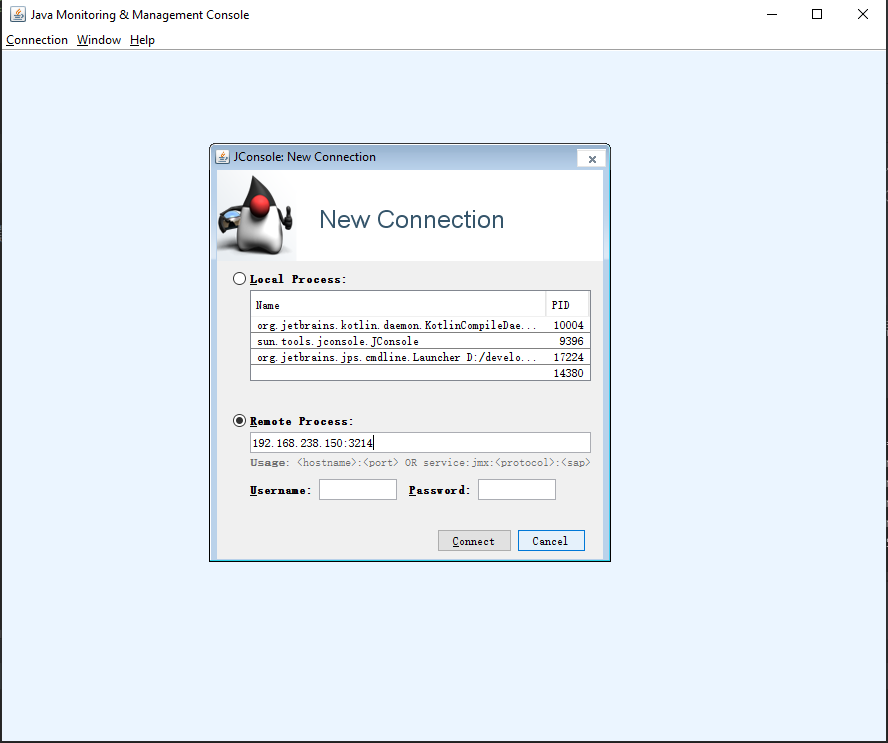
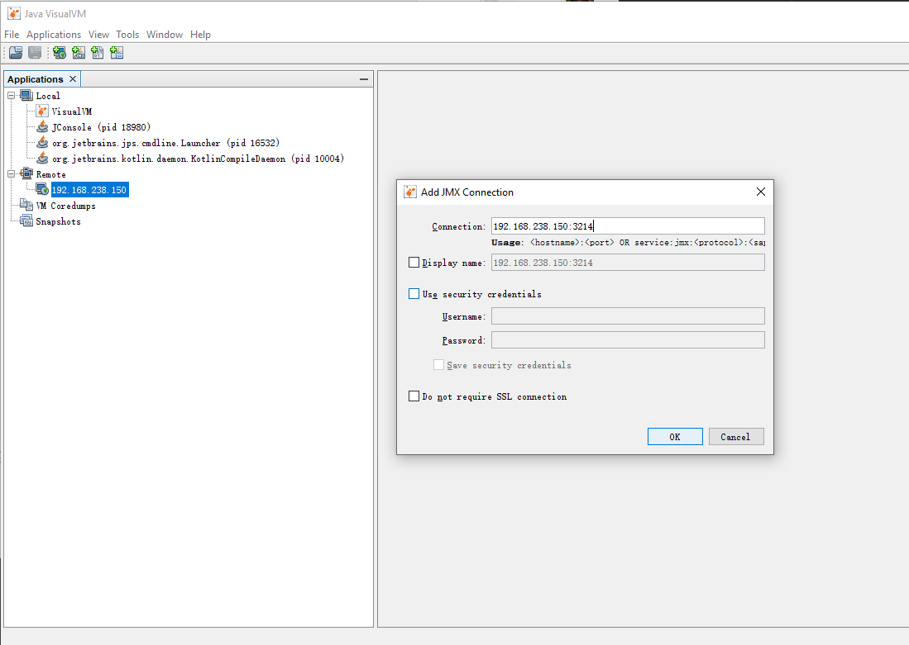
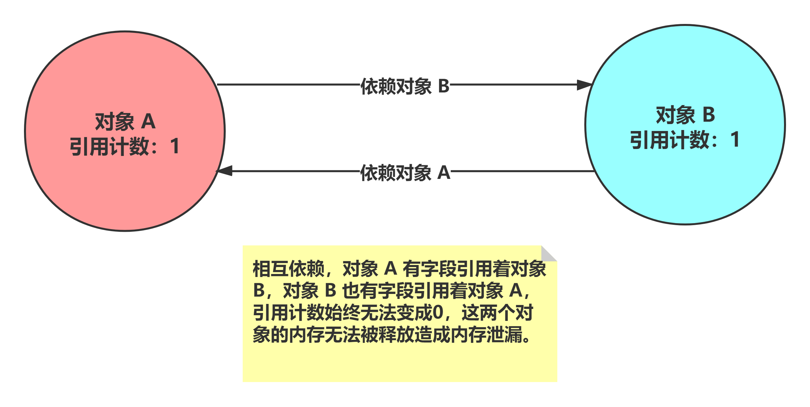
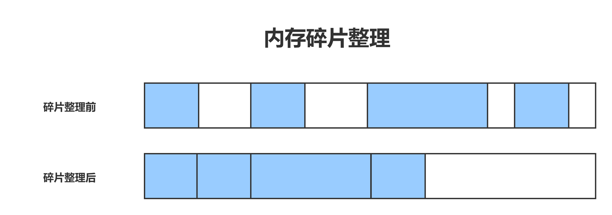
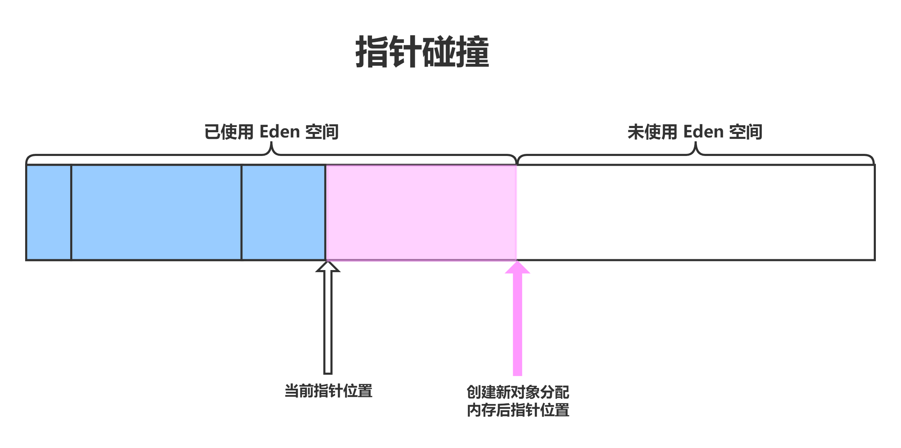

# 第一周第二课
# 作业
  - 第一题: 
  
# 笔记目录
  - [1. JDK 自带命令行工具](#jdkCommandTools)
    - [1.1 jps](#jpsCommand)
    - [1.2 jinfo](#jinfoCommand)
    - [1.3 jstat](#jstatCommand)
    - [1.4 jmap](#jmapCommand)
    - [1.5 jstack](#jstackCommand)
    - [1.6 jcmd](#jcmdCommand)
    - [1.7 执行 JDK 工具命令连接查看远程服务器](#jdkCommandConnectRemoteServer)
  - [2. 图形化工具](#guiTools)
    - [2.1 jconsole](#jconsole)
    - [2.2 jvisualvm](#jvisualvm)
    - [2.3 jmc](#jmc)
  - [3. GC (Garbage Collection)](#gc)
    - [3.1 垃圾回收算法](#gcAlgorithm)
    - [3.2 内存碎片整理](#memoryDefragmentation)
    - [3.3 分代假设](#generationalHypothesis)
    - [3.4 堆内存池划分](#heapPartition)
      - [3.4.1 年轻代(新生代) (Young Generation、New Generation)](#youngGen)
---------------------
# <span id="jdkCommandTools">1. JDK 自带命令行工具</span>
> 
>
>> ## <span id="jpsCommand">1.1 jps</span>
>> 用于查看 JVM 进程相关信息  
>>
>> jps 常用参数: 
>>   - -q: 只显示 JVM 进程
>>   - -m: 输出传递给main方法的参数
>>   - -l: 输出应用程序 main class 的完整 package 名或者应用程序的 jar 文件完整名称
>>   - -v: 输出传递给 JVM 的参数，可以看到 JVM 启动参数
>>   - 参数组合使用: -mlv，将 -m、-l、-v 组合使用
>>
>> jps 常见问题:
>>   1. 执行 jps 命令后不显示任何 JVM 进程  
>>     当 java 程序运行时会开启对应的一个 JVM 进程，进程的信息写在了临时文件夹的 hsperfdata_currentUserName 目录中，如果是 Windows 
>>     系统就是环境变量 %TEMP%\hsperfdata_currentUserName，如果是 Linux 系统就是 /tmp/hsperfdata_currentUserName 目录中。jps 是
>>     通过读取该目录下的文件来显示当前运行的 JVM 进程。所以出现此问题的原因有三种:
>>       - 该目录的没有磁盘读写权限
>>       - 临时文件丢失，被删除或是定期清理
>>       - JVM 进程信息文件存储地址被设置，不在/tmp目录下。-Djava.io.tmpdir 可以修改这个目录，但是 jps、jconsole 都只会从 /tmp(%TEMP%\) 目录中去读取
>>
>> ## <span id="jinfoCommand">1.2 jinfo</span>
>> 用于打印和动态修改虚拟机参数，也可以打印 JVM 参数和系统参数。
>> 
>> jinfo 语法: 
```
Usage:
    jinfo [option] <pid>
        (to connect to running process)
    jinfo [option] <executable <core>
        (to connect to a core file)
    jinfo [option] [server_id@]<remote server IP or hostname>
        (to connect to remote debug server)

where <option> is one of:
    -flag <name>         to print the value of the named VM flag
    -flag [+|-]<name>    to enable or disable the named VM flag
    -flag <name>=<value> to set the named VM flag to the given value
    -flags               to print VM flags
    -sysprops            to print Java system properties
    <no option>          to print both of the above
    -h | -help           to print this help message
```
>> jinfo 常用参数: 
>>   - -flag \<name>: 用于打印虚拟机标记参数的值，name表示虚拟机标记参数的名称，用来查看某个 JVM 启动参数当前的状态，是开启还是关闭。
>>   - -flag \[+|-]<name>: 用于开启或关闭 JVM 标记参数。+表示开启，-表示关闭。
>>   - -flag \<name>=\<value>: 用于设置 JVM 标记参数，但并不是每个参数都可以被动态修改的。
>>   - -flags: 打印 JVM 参数
>>   - -sysprops: 打印系统参数
>>   - 不指定参数标签: 默认打印 JVM 参数和系统参数
>>
>> ## <span id="jstatCommand">1.3 jstat</span>
>> jstat 语法: jstat \[-命令选项] \[JVM 进程 ID] \[间隔时间/毫秒] \[查询次数]  
>>
>> jstat 常用参数: 
>>> #### 1. 类加载器信息统计
>>> 命令: jstat -class pid
>>> 
>>> 结果: 
```
d:\>jstat -class 6820
Loaded  Bytes   Unloaded    Bytes      Time
  6592 11888.0         0     0.0       1.67
```
>>> 详解:
>>>   - Loaded: 加载 class 的数量
>>>   - Bytes: 加载类所占用的字节数
>>>   - Unloaded: 卸载类的数量
>>>   - Bytes: 卸载类的字节数
>>>   - Time: 加载和卸载类所花费的时间
>>>
>>> #### 2. 编译信息统计
>>> 命令: jstat -compiler pid
>>>
>>> 结果: 
```
d:\>jstat -compiler 6820
Compiled Failed Invalid   Time   FailedType FailedMethod
    3970      4       0     6.79          1 org/springframework/core/annotation/AnnotationUtils findAnnotation
```
>>> 详解: 
>>>   - Compiled: 编译任务执行数量
>>>   - Failed: 编译任务执行失败数量
>>>   - Invalid: 编译任务执行失效数量
>>>   - Time: 编译任务消耗时间
>>>   - FailedType: 最后一个编译失败任务的类型
>>>   - FailedMethod: 最后一个编译失败任务所在的类及方法
>>>
>>> #### 3. 堆内存与垃圾回收统计
>>> 命令: jstat -gc pid
>>>
>>> 结果:
```
d:\>jstat -gc 17844
 S0C    S1C     S0U     S1U      EC       EU        OC         OU       MC     MU    CCSC   CCSU   YGC     YGCT    FGC    FGCT     GCT
21504.0 21504.0  0.0    0.0   131584.0 97391.5   349696.0     0.0     4480.0 776.7  384.0   76.6       0    0.000   0      0.000    0.000
```
>>> 详解:
>>>   - S0C: survivor0 的容量 (KB)
>>>   - S1C: survivor1 的容量 (KB)
>>>   - S0U: survivor0 目前已使用空间 (KB)
>>>   - S1U: survivor1 目前已使用空间 (KB)
>>>   - EC: 年轻代中Eden（伊甸园）的容量 (KB)
>>>   - EU: 年轻代中Eden（伊甸园）目前已使用空间 (KB)
>>>   - OC: 老年代的容量 (KB)
>>>   - OU: 老年代目前已使用空间 (KB)
>>>   - MC: Metaspace 的容量 (KB)
>>>   - MU: Metaspace 目前已使用空间 (KB)
>>>   - CCSC: 压缩类空间的容量 (KB)
>>>   - CCSU: 压缩类空间目前已使用空间 (KB)
>>>   - YGC: 从应用程序启动到采样时年轻代中gc次数
>>>   - YGCT: 从应用程序启动到采样时年轻代中gc所用时间(s)
>>>   - FGC: 从应用程序启动到采样时老年代(全gc、Full GC)gc次数
>>>   - FGCT: 从应用程序启动到采样时老年代(全gc、Full GC)gc所用时间(s)
>>>   - GCT: 从应用程序启动到采样时gc用的总时间(s)
>>>
>>> #### 4. 堆内存容量统计
>>> 命令: jstat -gccapacity pid
>>>
>>> 结果: 
```
d:\>jstat -gccapacity 6820
 NGCMN    NGCMX     NGC     S0C      S1C       EC      OGCMN      OGCMX       OGC         OC        MCMN     MCMX      MC       CCSMN    CCSMX     CCSC    YGC    FGC
174592.0 2789376.0 517632.0 17408.0 21504.0 263168.0   349696.0  5578752.0   154624.0   154624.0      0.0 1079296.0  33276.0      0.0 1048576.0   4348.0      5     1
```
>>> 详解: 
>>>   - NGCMN: 年轻代(young)中初始化(最小)的大小 (KB)
>>>   - NGCMX: 年轻代(young)的最大容量 (KB)
>>>   - NGC: 年轻代(young)中当前的容量 (KB)
>>>   - S0C: survivor0 的容量 (KB)
>>>   - S1C: survivor1 的容量 (KB)
>>>   - EC: 年轻代中Eden（伊甸园）的容量 (KB)
>>>   - OGCMN: 老年代中初始化(最小)的大小 (KB)
>>>   - OGCMX: 老年代的最大容量 (KB)
>>>   - OGC: 老年代当前新生成的容量 (KB)
>>>   - OC: 老年代当前的容量 (KB)
>>>   - MCMN: Metaspace 最小容量 (KB)
>>>   - MCMX: Metaspace 最大容量 (KB)
>>>   - MC: 当前 Metaspace 空间大小 (KB)
>>>   - CCSMN: 最小压缩类空间的容量 (KB)
>>>   - CCSMX: 最大压缩类空间的容量 (KB)
>>>   - CCSC: 当前压缩类空间大小 (KB)
>>>   - YGC: 从应用程序启动到采样时年轻代中gc次数
>>>   - FGC: 从应用程序启动到采样时old代(全gc)gc次数
>>>
>>> #### 5. 年轻代（新生代）区域统计
>>> 命令: jstat -gcnew pid
>>> 
>>> 结果: 
```
 S0C    S1C       S0U    S1U   TT MTT  DSS      EC       EU       YGC     YGCT  
37376.0 21504.0    0.0 21480.7  6  15 37376.0 217088.0 127944.0      5    0.067
```
>>> 详解:
>>>   - S0C: survivor0 的容量 (KB)
>>>   - S1C: survivor1 的容量 (KB)
>>>   - S0U: survivor0 目前已使用空间 (KB)
>>>   - S1U: survivor1 目前已使用空间 (KB)
>>>   - TT: 持有次数限制
>>>   - MTT: 最大持有次数限制
>>>   - DSS: 期望的 survivor 大小 (KB)
>>>   - EC: 年轻代中Eden（伊甸园）的容量 (KB)
>>>   - EU: 年轻代中Eden（伊甸园）目前已使用空间 (KB)
>>>   - YGC: 从应用程序启动到采样时年轻代中gc次数
>>>   - YGCT: 从应用程序启动到采样时年轻代中gc所用时间(s)
>>>
>>> #### 6. 年轻代（新生代）容量统计
>>> 命令: jstat -gcnewcapacity pid
>>>
>>> 结果:
```
  NGCMN      NGCMX       NGC      S0CMX     S0C     S1CMX     S1C       ECMX        EC      YGC   FGC 
  174592.0  1397760.0   450560.0 465920.0  37376.0 465920.0  21504.0  1396736.0   217088.0     5     1
```
>>> 详解:
>>>   - NGCMN: 年轻代(young)中初始化(最小)的大小 (KB)
>>>   - NGCMX: 年轻代(young)的最大容量 (KB)
>>>   - NGC: 年轻代(young)中当前的容量 (KB)
>>>   - S0CMX: 年轻代中 survivor0 的最大容量 (KB)
>>>   - S0C: 年轻代中 survivor0 的容量 (KB)
>>>   - S1CMX: 年轻代中 survivor1 的最大容量 (KB)
>>>   - S1C: 年轻代中 survivor1 的最大容量 (KB)
>>>   - ECMX: 年轻代中Eden（伊甸园）的最大容量 (KB)
>>>   - EC: 年轻代中Eden（伊甸园）的容量 (KB)
>>>   - YGC: 从应用程序启动到采样时年轻代中gc次数
>>>   - FGC: 从应用程序启动到采样时old代(全gc)gc次数
>>>
>>> #### 7. 老年代区域统计
>>> 命令: jstat -gcold pid
>>> 
>>> 结果:
```
   MC       MU      CCSC     CCSU       OC          OU       YGC    FGC    FGCT     GCT   
 25216.0  24141.1   3712.0   3437.9    349696.0     27429.0      5     1    0.025    0.092
```
>>> 详解:
>>>   - MC: Metaspace 的容量 (KB)
>>>   - MU: Metaspace 目前已使用空间 (KB)
>>>   - CCSC: 压缩类空间的容量 (KB)
>>>   - CCSU: 压缩类空间目前已使用空间 (KB)
>>>   - OC: 老年代的容量 (KB)
>>>   - OU: 老年代目前已使用空间 (KB)
>>>   - YGC: 从应用程序启动到采样时年轻代中gc次数
>>>   - FGC: 从应用程序启动到采样时old代(全gc)gc次数
>>>   - FGCT: 从应用程序启动到采样时old代(全gc)gc所用时间(s)
>>>   - GCT: 从应用程序启动到采样时gc用的总时间(s)
>>>
>>> #### 8. 老年代容量统计
>>> 命令: jstat -gcoldcapacity pid
>>>
>>> 结果:
```
   OGCMN       OGCMX        OGC         OC       YGC   FGC    FGCT     GCT   
   349696.0   2796544.0    349696.0    349696.0     5     1    0.025    0.092
```
>>> 详解:
>>>   - OGCMN: 老年代中初始化(最小)的大小 (KB)
>>>   - OGCMX: 老年代的最大容量(KB)
>>>   - OGC: 老年代当前新生成的容量 (KB)
>>>   - OC: 老年代的容量 (KB)
>>>   - YGC: 从应用程序启动到采样时年轻代中gc次数
>>>   - FGC: 从应用程序启动到采样时old代(全gc)gc次数
>>>   - FGCT: 从应用程序启动到采样时old代(全gc)gc所用时间(s)
>>>   - GCT: 从应用程序启动到采样时gc用的总时间(s)
>>>
>>> #### 9. 统计 gc 信息
>>> 命令: jstat -gcutil pid
>>>
>>> 结果:
```
  S0     S1     E      O      M     CCS    YGC     YGCT    FGC    FGCT     GCT   
  0.00  99.89  58.94   7.84  95.74  92.62      5    0.067     1    0.025    0.092
```
>>> 详解:
>>>   - S0: survivor0 已使用的占当前容量百分比
>>>   - S1: survivor1 已使用的占当前容量百分比
>>>   - E: 年轻代中Eden（伊甸园）已使用的占当前容量百分比
>>>   - O: 老年代已使用的占当前容量百分比
>>>   - M: Metaspace 已使用的占当前容量百分比
>>>   - CCS: 压缩空间使用比例
>>>   - YGC: 从应用程序启动到采样时年轻代中gc次数
>>>   - YGCT: 从应用程序启动到采样时年轻代中gc所用时间(s)
>>>   - FGC: 从应用程序启动到采样时old代(全gc)gc次数
>>>   - FGCT: 从应用程序启动到采样时old代(全gc)gc所用时间(s)
>>>   - GCT: 从应用程序启动到采样时gc用的总时间(s)
>>>
>> ## <span id="jmapCommand">1.4 jmap</span>
>> 用于查看堆内存的统计信息、导出堆快照文件、查看 ClassLoader 的信息以及 finalizer 队列
>>
>> 注意: 对于线上有流量的系统，慎重使用 jmap 命令。
>>
>> jmap 语法:
```
Usage:
    jmap [option] <pid>
        (to connect to running process)
    jmap [option] <executable <core>
        (to connect to a core file)
    jmap [option] [server_id@]<remote server IP or hostname>
        (to connect to remote debug server)

where <option> is one of:
    <none>               to print same info as Solaris pmap
    -heap                to print java heap summary
    -histo[:live]        to print histogram of java object heap; if the "live"
                         suboption is specified, only count live objects
    -clstats             to print class loader statistics
    -finalizerinfo       to print information on objects awaiting finalization
    -dump:<dump-options> to dump java heap in hprof binary format
                         dump-options:
                           live         dump only live objects; if not specified,
                                        all objects in the heap are dumped.
                           format=b     binary format
                           file=<file>  dump heap to <file>
                         Example: jmap -dump:live,format=b,file=heap.bin <pid>
    -F                   force. Use with -dump:<dump-options> <pid> or -histo
                         to force a heap dump or histogram when <pid> does not
                         respond. The "live" suboption is not supported
                         in this mode.
    -h | -help           to print this help message
    -J<flag>             to pass <flag> directly to the runtime system
```
>> jmap 常用参数:
>>> #### 1. 不加 option 参数:
>>> 命令: jmap pid
>>>
>>> 结果:
```
Attaching to process ID 2919, please wait...
Debugger attached successfully.
Server compiler detected.
JVM version is 25.271-b09
0x00005649da78c000      8K      /home/jdk/jdk1.8.0_271/bin/java
0x00007fc6058c4000      91K     /home/jdk/jdk1.8.0_271/jre/lib/amd64/libnio.so
0x00007fc606bab000      110K    /home/jdk/jdk1.8.0_271/jre/lib/amd64/libnet.so
0x00007fc606f8f000      50K     /home/jdk/jdk1.8.0_271/jre/lib/amd64/libmanagement.so
0x00007fc6200f8000      124K    /home/jdk/jdk1.8.0_271/jre/lib/amd64/libzip.so
0x00007fc620314000      89K     /usr/lib64/libnss_files-2.28.so
0x00007fc620d2b000      61K     /usr/lib64/libnss_sss.so.2
0x00007fc620f34000      226K    /home/jdk/jdk1.8.0_271/jre/lib/amd64/libjava.so
0x00007fc621163000      64K     /home/jdk/jdk1.8.0_271/jre/lib/amd64/libverify.so
0x00007fc621372000      96K     /usr/lib64/librt-2.28.so
0x00007fc62157b000      2651K   /usr/lib64/libm-2.28.so
0x00007fc6218fd000      16707K  /home/jdk/jdk1.8.0_271/jre/lib/amd64/server/libjvm.so
0x00007fc6228f4000      4078K   /usr/lib64/libc-2.28.so
0x00007fc622cb6000      35K     /usr/lib64/libdl-2.28.so
0x00007fc622eba000      106K    /home/jdk/jdk1.8.0_271/lib/amd64/jli/libjli.so
0x00007fc6230d2000      459K    /usr/lib64/libpthread-2.28.so
0x00007fc6232f2000      295K    /usr/lib64/ld-2.28.so
```
>>> 解释:
>>>   - 打印目标虚拟机中加载的每个共享对象的起始地址、映射大小以及共享对象文件的路径全称。
>>>
>>> #### 2. 查看堆内存详情
>>> 命令: jmap -heap pid
>>>
>>> 结果:
```
Attaching to process ID 2919, please wait...
Debugger attached successfully.
Server compiler detected.
JVM version is 25.271-b09

using thread-local object allocation.
Mark Sweep Compact GC

Heap Configuration:
   MinHeapFreeRatio         = 40
   MaxHeapFreeRatio         = 70
   MaxHeapSize              = 209715200 (200.0MB)
   NewSize                  = 4849664 (4.625MB)
   MaxNewSize               = 69861376 (66.625MB)
   OldSize                  = 9830400 (9.375MB)
   NewRatio                 = 2
   SurvivorRatio            = 8
   MetaspaceSize            = 21807104 (20.796875MB)
   CompressedClassSpaceSize = 1073741824 (1024.0MB)
   MaxMetaspaceSize         = 17592186044415 MB
   G1HeapRegionSize         = 0 (0.0MB)

Heap Usage:
New Generation (Eden + 1 Survivor Space):
   capacity = 14090240 (13.4375MB)
   used     = 13199384 (12.587913513183594MB)
   free     = 890856 (0.8495864868164062MB)
   93.67749591206395% used
Eden Space:
   capacity = 12582912 (12.0MB)
   used     = 12218576 (11.652542114257812MB)
   free     = 364336 (0.3474578857421875MB)
   97.10451761881511% used
From Space:
   capacity = 1507328 (1.4375MB)
   used     = 980808 (0.9353713989257812MB)
   free     = 526520 (0.5021286010742188MB)
   65.06931470788044% used
To Space:
   capacity = 1507328 (1.4375MB)
   used     = 0 (0.0MB)
   free     = 1507328 (1.4375MB)
   0.0% used
tenured generation:
   capacity = 31072256 (29.6328125MB)
   used     = 19234976 (18.343902587890625MB)
   free     = 11837280 (11.288909912109375MB)
   61.90402138808331% used

15213 interned Strings occupying 2069168 bytes.
```
>>> 详解:
>>>   - Heap Configuration: 堆内存配置信息
>>>     - MinHeapFreeRatio: 空闲堆空间的最小百分比，值为 0 到 100 之间，默认值为 40  
>>>                         空闲堆空间百分比（HeapFreeRatio）= (CurrentFreeHeapSize / CurrentTotalHeapSize) * 100  
>>>                         当 HeapFreeRatio < MinHeapFreeRatio 时，则会进行堆扩容，扩容的时机应该在每次垃圾回收之后。
>>>     - MaxHeapFreeRatio: 空闲堆空间的最大百分比，值为 0 到 100 之间，默认值为 70
>>>                         当 HeapFreeRatio > MaxHeapFreeRatio 时，则会进行堆缩容，缩容的时机应该在每次垃圾回收之后。
>>>     - MaxHeapSize: 最大堆内存
>>>     - NewSize: 新生代内存大小
>>>     - MaxNewSize: 新生代最大内存大小
>>>     - OldSize: 老年代内存大小
>>>     - NewRatio: 新生代（2个 Survivor 区和 Eden 区）与老年代（只是 old 区，不包含 Metaspace）的堆空间比值，
>>>                 表示 新生代 : 老年代 = 1 : 2 或 老年代内存大小 / 新生代内存大小 约等于 2。
>>>     - SurvivorRatio: 2个 Survivor 区和 Eden 区的堆空间比，8 代表 S0 : S1 : Eden = 1 : 1 : 8
>>>     - MetaspaceSize: MetaspaceSize 空间的大小
>>>     - CompressedClassSpaceSize: 压缩类空间的大小
>>>     - MaxMetaspaceSize: MetaspaceSize 空间的最大大小
>>>     - G1HeapRegionSize: 使用 G1 GC 时 每个 Region 的空间大小，如果使用的 GC 不是 G1 ，那么就是 0
>>>   - Heap Usage: 堆内存使用信息
>>>     - New Generation (Eden + 1 Survivor Space): 新生代 (Eden 区 + 1个 Survivor) 的信息
>>>       - capacity: 此区域容量
>>>       - used: 此区域已使用大小
>>>       - free: 此区域未使用大小
>>>     - Eden Space: Eden 区的信息
>>>     - From Space: Survivor0 的信息
>>>     - To Space: Survivor1 的信息
>>>     - tenured generation(PS Old Generation): 老年代信息
>>>   - 15213 interned Strings occupying 2069168 bytes: 有 15213 个字符串常量占用了 2069168 个字节（1.973 MB）
>>>
>>> #### 3. 查看堆中对象的统计信息
>>> 命令: jmap -histo:live pid | jmap -histo pid
>>> 
>>> 结果:
```
 num     #instances         #bytes  class name
----------------------------------------------
   1:         37553        6488288  [C
   2:          8369        1785272  [I
   3:         36533         876792  java.lang.String
   4:          7017         779160  java.lang.Class
   5:         19728         631296  java.util.concurrent.ConcurrentHashMap$Node
   6:          1321         459024  [B
   7:          7045         370600  [Ljava.lang.Object;
   8:          3933         346104  java.lang.reflect.Method
   9:          8459         270688  java.util.HashMap$Node
  10:         14750         236000  java.lang.Object
  11:          2893         232104  [Ljava.util.HashMap$Node;
  12:          5583         223320  java.util.LinkedHashMap$Entry
  13:            99         172528  [Ljava.util.concurrent.ConcurrentHashMap$Node;
  14:          2705         151480  java.util.LinkedHashMap
  15:          2059          82360  java.lang.ref.SoftReference
  16:          1478          78680  [Ljava.lang.String;
  17:          3133          69016  [Ljava.lang.Class;
  18:          2829          67896  java.util.ArrayList
  19:           601          57696  org.springframework.beans.GenericTypeAwarePropertyDescriptor
  20:          1796          57472  java.lang.ref.WeakReference
  21:          1094          52512  java.util.HashMap
  22:           890          49840  java.lang.invoke.MemberName
  23:          1199          47960  java.util.TreeMap$Entry
  24:           594          47520  java.lang.reflect.Constructor
  25:           906          43488  org.apache.tomcat.util.modeler.AttributeInfo
  26:          1638          39312  java.beans.MethodRef
  27:          1597          38328  sun.reflect.generics.tree.SimpleClassTypeSignature
  28:          1444          34656  java.util.LinkedList$Node
  29:           864          34560  java.lang.invoke.MethodType

  其他省略 ...
```
>>> 详解:
>>>   - 如果指定了live子选项，则只计算活动的对象。
>>>   - 打印的虚拟机内部的类名称将会带有一个’*’前缀。
>>>   - \#instances: 实例对象的总数
>>>   - \#bytes: 占用内存大小
>>>   - class name: 全类名
>>>
>>> #### 4. 查看类加载器信息
>>> 命令: jmap -clstats pid
>>>
>>> 结果:
```
Attaching to process ID 2919, please wait...
Debugger attached successfully.
Server compiler detected.
JVM version is 25.271-b09
finding class loader instances ..done.
computing per loader stat ..done.
please wait.. computing liveness...................................................liveness analysis may be inaccurate ...
class_loader    classes bytes   parent_loader   alive?  type

<bootstrap>     2209    3776346   null          live    <internal>
0x00000000f80986c8      1       1476    0x00000000f7b92370      dead    sun/reflect/DelegatingClassLoader@0x000000010000a0a0
0x00000000f8062fc0      1       1473    0x00000000f7b92370      dead    sun/reflect/DelegatingClassLoader@0x000000010000a0a0
0x00000000f80e0ac8      1       1474      null          dead    sun/reflect/DelegatingClassLoader@0x000000010000a0a0
0x00000000f7b92370      3752    5718864 0x00000000f7b23e50      live    org/springframework/boot/loader/LaunchedURLClassLoader@0x0000000100060a10
0x00000000f7e96a60      1       880     0x00000000f7b92370      dead    sun/reflect/DelegatingClassLoader@0x000000010000a0a0
0x00000000f7c53448      1       880       null          dead    sun/reflect/DelegatingClassLoader@0x000000010000a0a0
0x00000000f7c6a3c8      1       880       null          dead    sun/reflect/DelegatingClassLoader@0x000000010000a0a0
0x00000000f7e67be8      1       880     0x00000000f7b92370      dead    sun/reflect/DelegatingClassLoader@0x000000010000a0a0
0x00000000f8063088      1       1473    0x00000000f7b92370      dead    sun/reflect/DelegatingClassLoader@0x000000010000a0a0
0x00000000f80e0a00      1       1473    0x00000000f7b92370      dead    sun/reflect/DelegatingClassLoader@0x000000010000a0a0
0x00000000f86ae778      0       0       0x00000000f7b92370      live    org/springframework/boot/web/embedded/tomcat/TomcatEmbeddedWebappClassLoader@0x00000001003fb348
0x00000000f7c6a490      1       1471    0x00000000f7b92370      dead    sun/reflect/DelegatingClassLoader@0x000000010000a0a0
0x00000000f7e67cb0      1       880     0x00000000f7b92370      dead    sun/reflect/DelegatingClassLoader@0x000000010000a0a0
0x00000000f80e0c58      1       1473    0x00000000f7b92370      dead    sun/reflect/DelegatingClassLoader@0x000000010000a0a0
0x00000000f7c092d8      0       0       0x00000000f7b23e50      live    java/util/ResourceBundle$RBClassLoader@0x00000001000c33a8
0x00000000f8098790      1       1473    0x00000000f7b92370      dead    sun/reflect/DelegatingClassLoader@0x000000010000a0a0
0x00000000f7c6a558      1       1471    0x00000000f7b92370      dead    sun/reflect/DelegatingClassLoader@0x000000010000a0a0
0x00000000f8063218      1       1473    0x00000000f7b92370      dead    sun/reflect/DelegatingClassLoader@0x000000010000a0a0
0x00000000f80e0b90      1       1473    0x00000000f7b92370      dead    sun/reflect/DelegatingClassLoader@0x000000010000a0a0
0x00000000f8002420      1       1505      null          dead    sun/reflect/DelegatingClassLoader@0x000000010000a0a0
0x00000000f7b23e50      38      61736   0x00000000f7b42dc0      live    sun/misc/Launcher$AppClassLoader@0x000000010000f958
0x00000000f7eb2148      1       880     0x00000000f7b92370      dead    sun/reflect/DelegatingClassLoader@0x000000010000a0a0
0x00000000f80632e0      1       1473    0x00000000f7b92370      dead    sun/reflect/DelegatingClassLoader@0x000000010000a0a0
0x00000000f80e0de8      1       1473    0x00000000f7b92370      dead    sun/reflect/DelegatingClassLoader@0x000000010000a0a0
0x00000000f8774290      1       880     0x00000000f7b92370      dead    sun/reflect/DelegatingClassLoader@0x000000010000a0a0
0x00000000f80e0d20      1       1473    0x00000000f7b92370      dead    sun/reflect/DelegatingClassLoader@0x000000010000a0a0
0x00000000f8774358      1       880     0x00000000f7b92370      dead    sun/reflect/DelegatingClassLoader@0x000000010000a0a0
0x00000000f87bd988      1       880       null          dead    sun/reflect/DelegatingClassLoader@0x000000010000a0a0
0x00000000f7b42dc0      25      27654     null          live    sun/misc/Launcher$ExtClassLoader@0x000000010000fd00
0x00000000f8063470      1       1473    0x00000000f7b92370      dead    sun/reflect/DelegatingClassLoader@0x000000010000a0a0
0x00000000f80e08b8      1       1476    0x00000000f7b92370      dead    sun/reflect/DelegatingClassLoader@0x000000010000a0a0
0x00000000f7eb2210      1       880     0x00000000f7b92370      dead    sun/reflect/DelegatingClassLoader@0x000000010000a0a0
0x00000000f8062ef8      1       1473    0x00000000f7b92370      dead    sun/reflect/DelegatingClassLoader@0x000000010000a0a0
0x00000000f8063538      1       1473    0x00000000f7b92370      dead    sun/reflect/DelegatingClassLoader@0x000000010000a0a0

total = 35      6053    9621422     N/A         alive=6, dead=29            N/A
```
>>> 详解:
>>>   - 连接到正在运行的进程，并打印有关Metaspace中加载的类的详细信息
>>>   - class_loader: 类加载器对象的地址
>>>   - classes: 加载的类的数量
>>>   - bytes: 该类加载加载的所有类的元数据所占用的大概存储空间
>>>   - parent_loader: 父类加载器的地址，如果没有显示 null
>>>   - alive?: live 表示未来不会被 GC 回收，dead 表示未来会被 GC 回收
>>>   - type: 该类加载器的名称
>>>
>>> #### 5. 查看 finalizer 信息
>>> finalizer 指的就是重写了 Object 的 finalize 方法的类，这些类会放在 finalizer 队列中。
>>> 此命令就是查看 finalizer 队列中的这些等待调用 finalize 方法的对象
>>>
>>> 命令: jmap -finalizerinfo pid
>>>
>>> 结果:
```
Attaching to process ID 2919, please wait...
Debugger attached successfully.
Server compiler detected.
JVM version is 25.271-b09
Number of objects pending for finalization: 0
```
>>> 解释: Number of objects pending for finalization: 0 表示 finalizer 队列中没有对象
>>>
>>> #### 6. 生成堆转储快照 dump 文件
>>> 命令: jmap -dump:format=b,file=heapdump.phrof pid
>>> 
>>> 参数详解:
>>>   - -dump:<dump-options>
>>>     - live: 只 dump 存活的对象
>>>     - format=b: 指定二进制格式
>>>     - file=<file>: 指定导出的文件路径
>>>
>> ## <span id="jstackCommand">1.5 jstack</span>
>> 用于查看线程栈信息，排查线程死锁
>>
>> jstack 语法:
```
Usage:
    jstack [-l] <pid>
        (to connect to running process)
    jstack -F [-m] [-l] <pid>
        (to connect to a hung process)
    jstack [-m] [-l] <executable> <core>
        (to connect to a core file)
    jstack [-m] [-l] [server_id@]<remote server IP or hostname>
        (to connect to a remote debug server)

Options:
    -F  to force a thread dump. Use when jstack <pid> does not respond (process is hung)
    -m  to print both java and native frames (mixed mode)
    -l  long listing. Prints additional information about locks
    -h or -help to print this help message
```
>> 参数详解:
>>   - -F: 强制 dump 线程栈信息，当查看的 JVM 进程无响应时（线程死锁）可以使用
>>   - -m: 打印 java 虚拟机栈 和 本地方法栈，这个参数不能用于远程服务器
>>   - -l: 长监听，打印有关锁的其他信息
>>
>> ## <span id="jcmdCommand">1.6 jcmd</span>
>> 将如 jmap、jstack 等一些进行整合
>>
>> 常用命令:
>>   - jcmd pid VM.version: 查看 JVM 版本信息
>>   - jcmd pid VM.flags: 与 jinfo -flags pid 等价，查看 JVM 参数
>>   - jcmd pid VM.command_line: 查看 JVM 启动的命令行参数信息
>>   - jcmd pid VM.system_properties: 查看 JVM 的属性信息
>>   - jcmd pid Thread.print: 与 jstack 等价，查看线程栈的信息
>>   - jcmd pid GC.class_histogram: 与 jmap -histo pid 等价，查看堆中对象的统计信息
>>   - jcmd pid GC.heap_info: 查看堆内存信息
>>
>> ## <span id="jdkCommandConnectRemoteServer">1.7 jmap 和 jstack 连接查看远程服务器</span>
>> jmap 和 jstack 支持连接远程服务器并执行命令查看远程服务器的信息
>>
>> 服务端:
>>   - 启动服务器端的 java 应用，并查看进程的 pid
>>   - 执行 jsadebugd pid server-id 命令，server-id 为启动的应用的一个名称，可以随便取名
>>
>> 客户端:
>>   - jmap -heap server-id@server_address
>>   - jstack -F server-id@server_address
>>
>> 使用注意事项: 
>>   - jstack -m 不能用于远程服务器
>>   - 客户端和服务端的 JVM 版本必须一致，否则不能使用
>>
# <span id="guiTools">2. 图形化工具</span>
> ## <span id="jconsole">2.1 jconsole</span>
> jconsole 是 JDK 自带的图形化工具，可以监控 CPU 使用率、 内存、线程、类加载、GC信息、手动执行 GC、JVM 概述以及 MBeans
> 
> jconsole 连接远程服务器:
>> jconsole 需要配置 JMX (Java Management Extensions、Java管理扩展) 才可以实现远程连接  
>>
>> 服务端配置:
```
java
 -Djava.rmi.server.hostname=192.168.238.150           # 远程服务器 ip
 -Dcom.sun.management.jmxremote                       # 允许 JMX 远程连接
 -Dcom.sun.management.jmxremote.port=3214             # 自定义 JMX 端口
 -Dcom.sun.management.jmxremote.ssl=false             # 是否需要 SSL 安全连接模式
 -Dcom.sun.management.jmxremote.authenticate=false    # 是否需要密钥
 -jar gateway-server-0.0.1-SNAPSHOT.jar
``` 
>>
>> jconsole 客户端:
>> 
>
> ## <span id="jvisualvm">2.2 jvisualvm</span>
> jmap，jinfo，jstat 和 jstack 提供的大多数功能已集成到 jvisualvm 中。可以监控 CPU 、内存、线程、GC。并且 jvisualvm 支持插件，
> 可以在 Tool - Plugins 中安装或卸载插件。GC 的详细信息需要手动安装 Visual GC 插件。idea 也有一个叫 Visual GC 的插件
>
> jvisualvm 也支持远程连接也是基于 JMX ，使用方式与 jconsole 相似，但是有些插件不支持远程服务器，会失效。
> 
>
> ## <span id="jmc">2.3 jmc</span>
> jmc 是源自 JRockit JVM 的一套监控和管理工具，功能最全。jmc 监控的是整个系统，而并非只是被选中的 JVM 进程。
>
# <span id="gc">3. GC (Garbage Collection)</span>
> ## <span id="gcAlgorithm">3.1 垃圾回收算法</span>
> ### 3.1.1 引用计数法
>> #### 1) 原理
>>> 当某个对象被引用的时候，该对象的引用计数器就加一，当该对象不被引用时引用计数器就减一，如果引用计数器为0时，就代表此对象
>>> 可以被回收。需要注意：一般不是一个引用计数到 0 了就立即释放，出于效率考虑，系统总是会等一批仓库一起处理，这样更加高效。
>
>> #### 2) 弊端
>>> 当存在循环引用依赖时，引用计数始终不为 0，就无法释放掉这些已经不使用的对象。
>>>
>>> 
>>>
>>> 引用计数法解决循环引用的方案:
>>>   - 在知道存在循环引用的地方，在合适的位置主动断开环中的引用依赖
>>>   - 使用弱引用来依赖
>>
>> 第一代自动垃圾收集算法，使用的是引用计数 (reference counting)。针对每个对象，只需要记住被引用的次数，当引用计数变为0时，
>> 这个对象就可以被安全地回收 (reclaimed) 了。
>>
>> 第二代的垃圾收集算法，被称为引用追踪 (reference tracing)，JVM 使用的各种垃圾收集算法都是基于引用追踪方式的算法。
>
> ### 3.1.2 标记清除算法 (Mark and Sweep)
>> #### 1) 原理
>>> 为了能够遍历所有的对象，JVM 定义了对象的可达性 (reachability)，有一种很明确很具体的对象，叫做垃圾收集根对象 (GC Roots)，包括:
>>>   - 局部变量 (Local Variables)
>>>   - 活动线程 (Active Threads)
>>>   - 静态字段 (Static fields)
>>>   - JNI引用 (JNI References)
>>>   - 跨代引用 (Intergenerational Reference)
>>>
>>> 标记清除算法分为两步:
>>>   - Marking (标记): 遍历所有的可达对象 (reachable objects)，并在本地内存 (native memory) 中标记下。
>>>   - Sweeping (清除): 这一步保证了，不可达对象 (non-reachable objects) 所占用的内存，在之后进行内存分配时可以重用。
>>> 
>>> 在标记的步骤中，有的实现是标记可达对象，有的实现是标记不可达对象。原理都是一样的。
>>> 
>>> JVM中包含了多种GC算法，如 Parallel Scavenge(并行清除)，Parallel Mark + Copy(并行标记+复制) 以及 CMS，他们在实现上略有不同，
>>> 但理论上都采用了以上两个步骤。标记清除算法最重要的优势，就是不再因为循环引用而导致内存泄露。
>>
>> #### 2) 弊端
>>> 垃圾收集过程中，需要暂停应用程序的所有线程。假如不暂停，则对象间 的引用关系会一直不停地发生变化，那样就没法进行统计了。
>>> 这种情况叫做 STW 停顿 (Stop The World Pause ，全线暂停)，让应用程序暂时停止，让JVM进行内存清理工作。有很多原因会触发 STW 停顿，
>>> 其中垃圾收集是最主要的原因。
>
> ## <span id="memoryDefragmentation">3.2 内存碎片整理</span>
> 在每次执行清除 (Sweeping) 之后，JVM 都必须保证不可达对象所占用的内存空间能被回收重用，但这就导致了内存的不连续而产生内存碎片。从而引发两个问题:
>>   - 写入操作越来越慢，因为寻找一片足够大的空闲内存会变得困难，并且这些内存碎片下次很可能因为分配算法的关系而无法再次重用。
>>   - 在创建新对象时，JVM 在连续的块中分配内存。如果内存碎片问题很严重，没有足够的空闲连续的内存段使用，就会发生内存分配错误
>>
>> 要避免这类问题，JVM 必须保证内存碎片问题可控。因此在垃圾收集过程中，标记清除之后，还需要执行“内存碎片整理”。
>>
>> 
>>
>> 注意: 如果 GC 移动了某个对象，就会修改栈和堆中所指向该对象的引用。移动/复制/压缩都会 STW，所以修改某个的对象的引用是安全的，
>>       但要更新所有指向该对象的引用，可能会影响性能。
>
> ## <span id="generationalHypothesis">3.3 分代假设</span>
>> 创建的对象越多，收集垃圾的时间就会越长，STW 的时间也会越长。程序中大多数可回收的内存可分为两类:
>>   - 大部分对象很快就不在使用或立刻就无用，生命周期很短。
>>   - 不会立即无用，但是也不会使用太长时间
>>
>> 根据这个情况就形成了弱分代假设 (weak generational hypothesis) 理论，这一假设任为”大多数对象在年轻时死亡“。
>> JVM 根据这个理论将堆内存分为年轻代 (Young Generation、New Generation) 和老年代 (Old Generation、Tenured Generation)。拆分
>> 这两个可单独清理的区域，就可以使用不同的 GC 算法来提高 GC 的性能。
>>
>> 分代假设的弊端: 实际情况中，在不同的分代中的对象可能存在相互引用，比如年轻代的对象引用着老年代的对象，老年代的对象引用着年轻代的对象
>                分代假设并不适用于所有程序。因为分代 GC 算法专门针对“要么死得快”，“否则活 得长” 这类特征的对象来进行优化，
>                此时 JVM 管理那种存活时间半长不长的对象就显得非常尴尬了。
>
> ## <span id="heapPartition">3.4 堆内存池划分</span>
> ### <span id="youngGen">3.4.1 年轻代(新生代) (Young Generation、New Generation)</span>
>> 年轻代细分为 Eden 区、Survivor0 (from)、Survivor1 (to)
>> #### 1) Eden Space
>>> Eden 区也叫伊甸区，是堆内存中的一个区域，用来分配新创建的对象。通常情况会有多个线程并发的创建多个对象，出现线程安全问题，
>>> 这样就会产生指针碰撞问题。
>>>
>>> #### a. 指针碰撞问题
>>>> 假设 JVM 上堆内存现在是规整的，没有碎片。堆内存被指针一分为二，左边是已经使用的内存区域，右边是未使用的内存区域，
>>>>          每次新创建了一个对象时指针就会向右移动对象大小的距离，这被称为指针碰撞。
>>>>
>>>> 
>>>>
>>>> 指针碰撞问题在于多线程并发情况下，一个线程正在给对象 A 分配内存空间，指针还没有来得及修改，同时另一个线程正在给对象 B 分配内存，
>>>> 这样就会出现在同一块内存区域同时被分配多次的问题。
>>>> 
>>>> java 的 Eden 区在解决这个问题的方案是将 Eden 区划分出多个 TLAB (线程本地分配缓冲区)，TLAB 是每个线程独享的，每个线程只在属于
>>>> 自己的 TLAB 中分配各自所需的内存。如果 TLAB 中没有足够的内存空间，就会在共享 Eden 区(shared Eden space)之中分配。
>>>> 如果共享 Eden 区也没有足够的空间，就会触发一次年轻代 GC 来释放内存空间。如果GC之后 Eden 区依然没有足够的空闲内存区域，则对象就会被分配到老年代。
>>>> 当 Eden 区进行垃圾收集时，GC 将从 GC Root 根对象开始，遍历一次所有可达对象，并标记为存活对象。
>>>
>>> 但是对象间可能存在跨代引用，比如老年代对象引用年轻代对象，要保证年轻代 GC 时，不能把老年代对象引用的年轻代对象给回收了，
>>> 这时就出现了跨代引用问题。
>>> 
>>> #### b. 跨代引用问题
>>>> 为了解决这个问题，垃圾收集器会在年轻代中建立一个叫记忆集 (Remembered Set) 的全局的数据结构，以避免扫描整个老年代的可达对象。
>>>> HotSpot JVM 使用卡片标记 (Card Marking) 来实现记忆集并解决这个问题。
>>>>
>>>> 卡片标记: HotSpot JVM 具体是使用卡表 (Card Table) 和写屏障 (Write Barrier) 来实现。
>>>>
>>>> 卡表 (Card Table): HotSpot JVM 中的卡表是一个字节数组，将老年代划分成一个一个固定大小的内存块，这个内存块被称为卡页 (Card Page) ，
>>>> 并且字节数组的每个元素保存的都是某一块固定大小的内存块 (卡页) 的标识。
```C
// 右移位运算等价于 this address 除以 512
CARD_TABLE[this address >> 9] = 0;
```
>>>> 通常情况，卡页的大小都是2的 N 次幂，HotSpot JVM 的卡页是2的9次幂也就是512字节。一个卡页的内存中通常包含不止一个对象，
>>>> 每次修改老年代中某个对象的引用字段时，就会将该对象对应的卡页的标识设置为1 (默认值为0)，意为这块区域为脏 (Dirty)，表示可能存在跨代引用。
>>>> 在执行 minor GC 的时候只对标记为脏卡的内存区域进行扫描，这样就避免了扫描整个老年代。
>>>> 
>>>> 在高并发场景下，卡页标记为脏这个操作存在竞争会存在重复操作，使用 JVM 启动参数 -XX:UseCondCardMark 可以避免这个问题。
>>>> 开启后在执行写屏障标记卡页为脏前，会先做个简单的判断，如果卡页已经标记过了，就不再标记。
```C
if (CARD_TABLE [this address >> 9] != 0)
  CARD_TABLE [this address >> 9] = 0;
```
>>>> 写屏障: 写屏障可以看作再虚拟机层面对“引用类型字段赋值”这个操作的 AOP 切面，在赋值前或复制后执行一些额外的操作。
>>>> 在赋值前的部分的写屏障叫作写前屏障 (Pre-Write Barrier)，在赋值后的则叫作写后屏障 (Post-Write Barrier)。
>>>> HotSpot 虚拟机的许多收集器中都有使用到写屏障，但直到 G1 收集器出现之前，其他收集器都只用到了写后屏障。
>>>> 所以在这里写屏障指得就是维护卡页状态的代码，由 JVM 自动加入。
>>>
>>> 
>
>
>
>
>
>
>
>
>
>
>
>
>
>
>
>
>
>
>
>
>
>
>