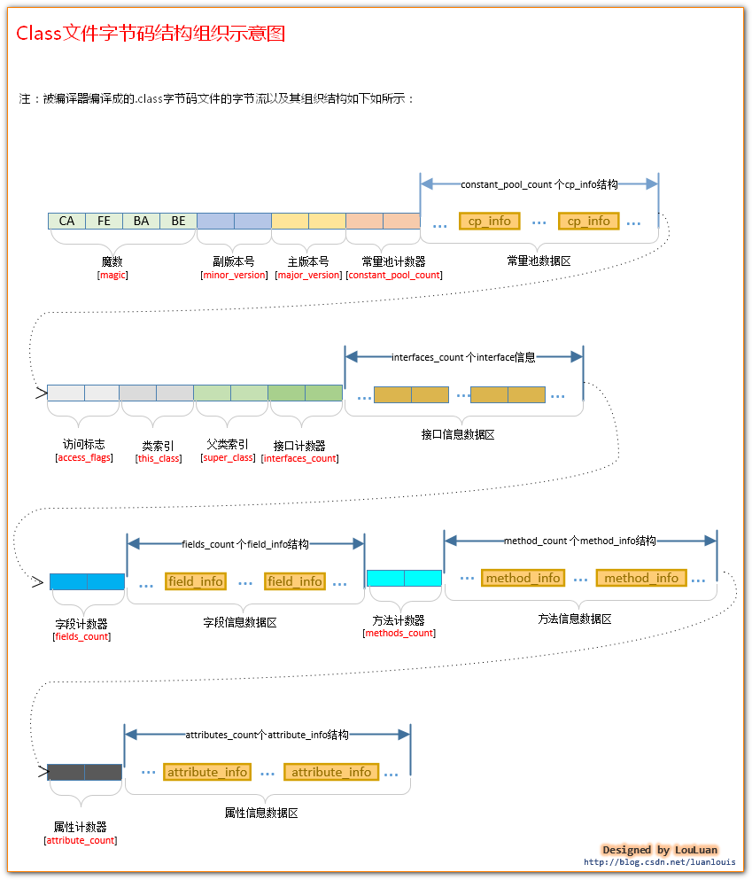
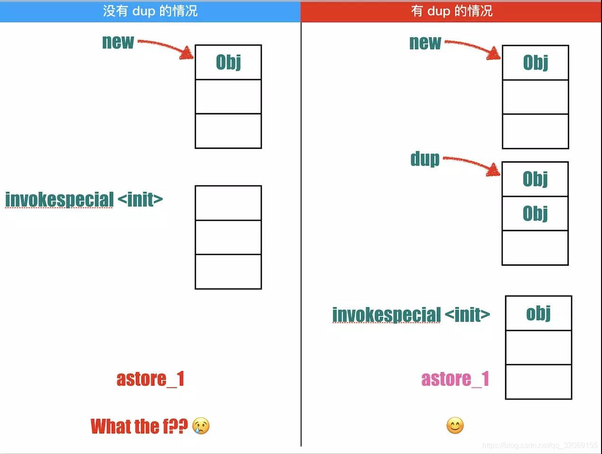
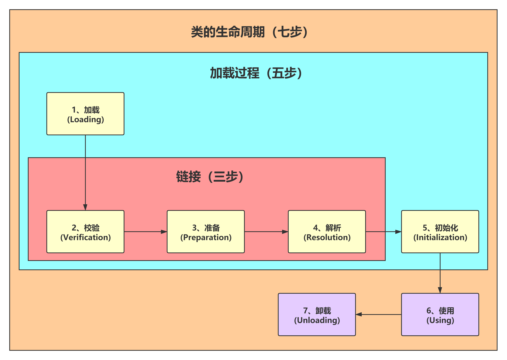
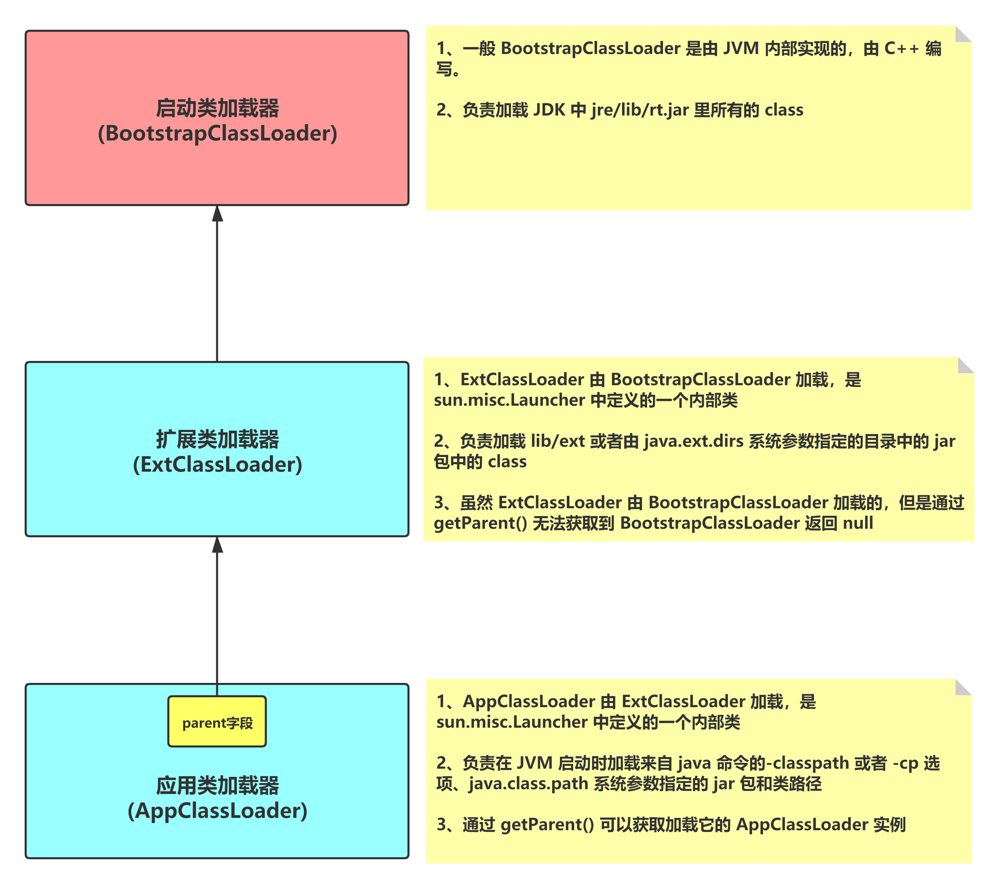
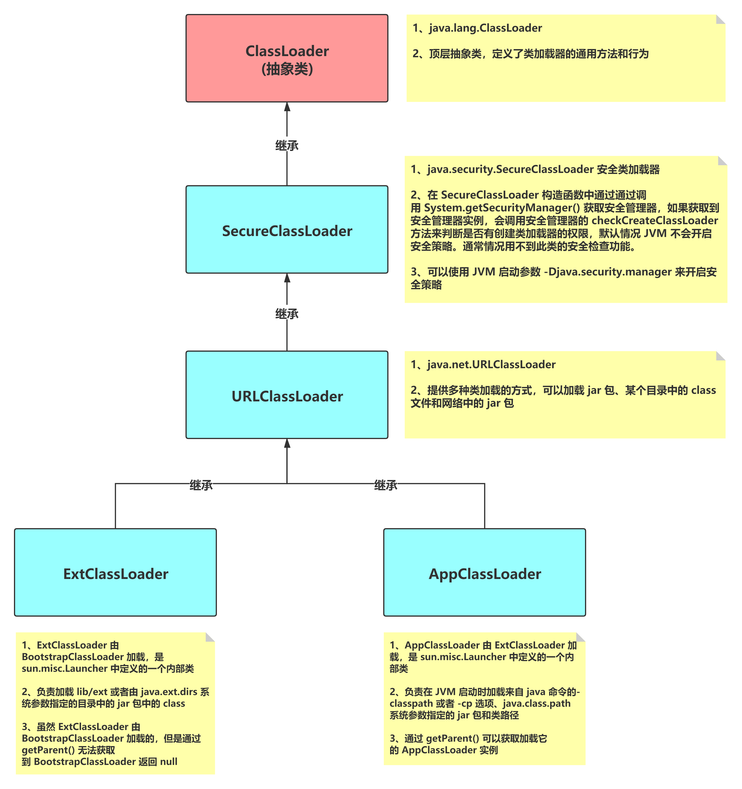
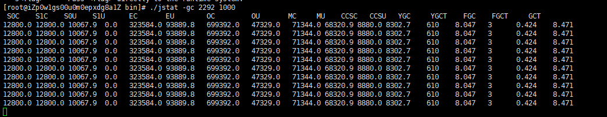

# 第一周第一课
# 作业
  - 第一题: [字节码文件分析](#byteCodeFileAnalysis)
  - 第二题: <https://github.com/WebbDong/JAVA-01/blob/main/Week_01/lesson01/classloader/HelloClassLoader.java>
  - 第三题: [启动参数与 JVM 内存结构](#JVMMemoryStructureAndJMM)
  - 第四题: [jstat、jstack 和 jmap 使用示例](#jstatjstackjmapExample)
  
# 笔记目录
  - [1. Java 字节码](#javaByteCode)
    - [1.1 Java 字节码简介](#javaByteCodeIntroduction)
    - [1.2 Java 字节码文件结构简述](#javaByteCodeStructure)
    - [1.3 字节码文件分析](#byteCodeFileAnalysis)
    - [1.4 字节码相关 JDK 命令行工具](#byteCodeJDKCommandTools)
  - [2. 类加载器](#classLoader)
    - [2.1 类的生命周期和加载过程](#classLifeCycleAndLoading)
    - [2.2 类加载时机](#classLoaderOpportunity)
    - [2.3 不执行类初始化的情况](#noInitializationCondition)
    - [2.4 类加载器机制](#classLoadingMechanism)
  - [3. JVM 内存结构和 Java 内存模型](#JVMMemoryStructureAndJMM)
  - [4. 常用 JVM 启动参数](#JVMArgs)
  - [5. jstat、jstack 和 jmap 使用示例](#jstatjstackjmapExample)
-------------
# <span id="javaByteCode">1. Java 字节码</span>
## <span id="javaByteCodeIntroduction">1.1 Java 字节码简介</span>
> Java 字节码由单字节（byte）的指令组成，理论上最多支持 256 个操作码（opcode）。实际上 Java 只使用了200左右的操作码， 还有一些操作码则保留给调试操作。
>
> 根据指令的性质，主要分为四个大类:
>> 1.栈操作指令，包括与局部变量交互的指令  
>> 2.程序流程控制指令  
>> 3.对象操作指令，包括方法调用指令  
>> 4.算术运算以及类型转换指令
>
> 字节码的运行时结构:
>> JVM 基于栈的计算模型每个线程都有一个独属于自己的线程栈（JVM Stack），用于存储栈帧（Stack Frame）。  
>> 每一次方法调用，JVM 都会自动创建一个栈帧。每当为 Java 方法分配栈桢时，JVM 需要开辟一块额外的空间作为操作数栈，来存放计算的操作数以及返回结果。  
>
> 栈桢的组成部分:
>> 1.局部变量表 (Local Variables)  
>> 2.操作数栈 (Operand Stack)  
>> 3.动态链接 (Dynamic Linking)  
>> 4.方法返回地址 (Return Address)
>
> 下图所示:
> .png "栈桢")
>
> 操作码（指令）由类型前缀**类型前缀**和**操作名称**两部分组成，例如: iadd 操作码，i 代表 Integer 类型，add 代表加法操作，
> 所以 iadd 就是整数类型数据的加法操作。
>
## <span id="javaByteCodeStructure">1.2 Java 字节码文件结构简述</span>
> ### 字节码文件结构
> 
> 
> 

## <span id="byteCodeFileAnalysis">1.3 字节码文件分析</span>
> 以下字节码分析都是基于工程中 [HelloByteCode](./bytecode/HelloByteCode.java) 使用 javap 反编译之后来展开。
> ### (1) 类信息与常量池信息
```
Classfile /D:/lesson01/bytecode/HelloByteCode.class
  Last modified Jan 9, 2021; size 1888 bytes
  MD5 checksum d0225425f9a99537afc8664fa6125129
  Compiled from "HelloByteCode.java"
public class lesson01.bytecode.HelloByteCode
  minor version: 0
  major version: 52
  flags: ACC_PUBLIC, ACC_SUPER
Constant pool:
    #1 = Methodref          #7.#60        // java/lang/Object."<init>":()V
    #2 = Fieldref           #61.#62       // java/lang/System.out:Ljava/io/PrintStream;
    #3 = String             #32           // myMethod
    #4 = Methodref          #63.#64       // java/io/PrintStream.println:(Ljava/lang/String;)V
    #5 = String             #33           // myStaticMethod
    #6 = String             #65           // sum = %d, division = %d, multiplication = %d, sub = %d%n
    #7 = Class              #66           // java/lang/Object
    #8 = Methodref          #67.#68       // java/lang/Integer.valueOf:(I)Ljava/lang/Integer;
    #9 = Methodref          #63.#69       // java/io/PrintStream.printf:(Ljava/lang/String;[Ljava/lang/Object;)Ljava/io/PrintStream;
   #10 = Long               6000000l
   #12 = Float              3.14f
```
> 1. minor version 与 major version: 字节码格式版本号，52.0 = JDK8
> 2. flags: 访问权限修饰与属性
>   - ACC_PUBLIC 表示当前类的访问修饰是 public
>   - ACC_SUPER 是历史原因, JDK1.0 的BUG修正中引入 ACC_SUPER 标志来修正 invokespecial 指令调用 super 类方法的问题，从 Java 1.1 开始， 编译器一般都会自动生成 ACC_SUPER 标志。
> 3. Constant pool: 常量池
>   - \#1、\#2: 这些表示常量池成员的编号，常量池成员可以存储字符串、整数、浮点数、符号引用、常量编号(索引值)
>   - Methodref、Fieldref、String等: 用于说明此常量位存储的是什么类型的数据，例如 Methodref 代表这个常量指向的是一个方法
>
> ### (2) 方法信息
```
  public double myPublicMethod(int, double, java.lang.String);
    descriptor: (IDLjava/lang/String;)D
    flags: ACC_PUBLIC
    Code:
      stack=4, locals=5, args_size=4
         0: getstatic     #2                  // Field java/lang/System.out:Ljava/io/PrintStream;
         3: new           #3                  // class java/lang/StringBuilder
         6: dup
         7: invokespecial #4                  // Method java/lang/StringBuilder."<init>":()V
        10: ldc           #5                  // String myPublicMethod, x =
        12: invokevirtual #6                  // Method java/lang/StringBuilder.append:(Ljava/lang/String;)Ljava/lang/StringBuilder;
        15: iload_1
        16: invokevirtual #7                  // Method java/lang/StringBuilder.append:(I)Ljava/lang/StringBuilder;
        19: ldc           #8                  // String , d =
        21: invokevirtual #6                  // Method java/lang/StringBuilder.append:(Ljava/lang/String;)Ljava/lang/StringBuilder;
        24: dload_2
        25: invokevirtual #9                  // Method java/lang/StringBuilder.append:(D)Ljava/lang/StringBuilder;
        28: ldc           #10                 // String , str =
        30: invokevirtual #6                  // Method java/lang/StringBuilder.append:(Ljava/lang/String;)Ljava/lang/StringBuilder;
        33: aload         4
        35: invokevirtual #6                  // Method java/lang/StringBuilder.append:(Ljava/lang/String;)Ljava/lang/StringBuilder;
        38: invokevirtual #11                 // Method java/lang/StringBuilder.toString:()Ljava/lang/String;
        41: invokevirtual #12                 // Method java/io/PrintStream.println:(Ljava/lang/String;)V
        44: iload_1
        45: i2d
        46: dload_2
        47: dadd
        48: dreturn
      LineNumberTable:
        line 12: 0
        line 13: 44
      LocalVariableTable:
        Start  Length  Slot  Name   Signature
            0      49     0  this   Llesson01/bytecode/HelloByteCode;
            0      49     1     x   I
            0      49     2     d   D
            0      49     4   str   Ljava/lang/String;
```
> 1. descriptor: 方法描述
>   - (IDLjava/lang/String;)D
>     - 小括号内的为形参参数类型描述，小括号右边的是方法返回值类型描述。
>     - 小括号内 I 代表第一个参数为 int 类型，D 代表第二个参数为 double 类型。L 代表第三个参数是对象类型，java/lang/String 代表是 String 类型对象。
>     - 小括号右边的 D 代表方法的返回值为 double 类型。
> 2. flags: 访问权限修饰符，ACC_PUBLIC 代表 public 方法，ACC_STATIC 代表静态方法。
> 3. Code: 源代码对应的 JVM 操作码和操作数区域。在进行字节码增强时重点操作的就是 Code 区这一部分。
>   - 操作码左边的数字代表当前操作码在字节码二进制文件中的字节位置
>   - stack: 执行该方法时需要的栈深度
>   - locals: 需要在局部变量表中保留多少个槽位
>   - args_size: 方法的参数个数
>     - 此示例有3个形参，但是 args_size 是 4，这是因为非静态方法有 this 引用，this 被分配在局部变量表的第0号槽位中
> 4. LineNumberTable: 行号表
>   - 将 Code 区的操作码和源代码中的行号对应，Debug 的时候可以通过行号表来看源代码执行一行时需要执行多少个 JVM 操作码
>   - 例如 line 12: 0 ，12代表源代码的行号，0代表 Code 区操作码的行号
> 5. LocalVariableTable: 局部变量表
>   - 其中包含了方法的参数，以及在方法体内定义的局部变量。
>   - 元素个数等于 args_size
>   - Start 和 Length: 代表当前局部变量或方法参数在 Code 操作码区中的作用域范围
>     - 例如当前示例 start 为0，length 为49代表该变量的作用域从0一直到48，也就是整个方法体。
>   - Slot: 槽位，从0开始，如果访问的是64位数据类型变量(例如: long类型变量，double类型变量)会占用2个槽位。
>   - Name: 变量名
>   - Signature: 变量类型描述
>
> ### (3) 基本数据类型变量定义
```
Constant pool:
   #22 = Long               6000000l
   #24 = Float              3.14f
   #25 = Double             4125.5647d

  public static void main(java.lang.String[]);
    descriptor: ([Ljava/lang/String;)V
    flags: ACC_PUBLIC, ACC_STATIC
    Code:
      stack=7, locals=15, args_size=1
         0: bipush        10
         2: istore_1
         3: bipush        50
         5: istore_2

         .... 其他省略

        72: iconst_5
        73: istore        7
        75: ldc2_w        #22                 // long 6000000l
        78: lstore        8
        80: ldc           #24                 // float 3.14f
        82: fstore        10
        84: ldc2_w        #25                 // double 4125.5647d
        87: dstore        11
        89: iconst_1
        90: istore        13

        .... 其他省略

       246: return
      LocalVariableTable:
        Start  Length  Slot  Name   Signature
          162      18    14     i   I
            0     247     0  args   [Ljava/lang/String;
            3     244     1     x   I
            6     241     2     y   I
           13     234     3   sum   I
           18     229     4 division   I
           23     224     5 multiplication   I
           28     219     6   sub   I
           75     172     7     b   B
           80     167     8     l   J
           84     163    10     f   F
           89     158    11     d   D
           92     155    13  bool   Z
          233      14    14 helloByteCode   Llesson01/bytecode/HelloByteCode;
```
> 0行: 将常量10压入操作数栈的栈顶中  
> 2行: 将栈顶 int 类型的值保存到槽位为1的局部变量中，也就是把常量10赋值给变量 x  
> 3行: 将常量50压入操作数栈的栈顶中  
> 5行: 将栈顶 int 类型的值保存到槽位为2的局部变量中，也就是把常量10赋值给变量 y 
> 72行: 将常量5压入操作数栈的栈顶中  
> 73行: 将栈顶 int 类型的值保存到槽位为7的局部变量中，也就是把常量5赋值给变量 b   
> 75行: 将常量编号为22的 long 类型的常量值压入操作数栈的栈顶中  
> 78行: 将栈顶 long 类型的值保存到槽位为8的局部变量中，也就是把常量6000000赋值给变量 l  
> 80行: 将常量编号为24的 float 类型常量值压入操作数栈的栈顶中  
> 82行: 将栈顶 float 类型的值保存到槽位为10的局部变量中  
> 84行: 将常量编号为25的 double 类型常量值压入操作数栈的栈顶中  
> 87行: 将栈顶 double 类型的值保存到槽位为11的局部变量中  
>
> ### (4) 创建对象与对象初始化
```
Constant pool:
   #36 = Class              #121          // lesson01/bytecode/HelloByteCode
   #37 = Methodref          #36.#86       // lesson01/bytecode/HelloByteCode."<init>":()V
   #41 = Utf8               <init>
   #42 = Utf8               ()V
   #86 = NameAndType        #41:#42       // "<init>":()V
   #121 = Utf8               lesson01/bytecode/HelloByteCode

  public static void main(java.lang.String[]);
    descriptor: ([Ljava/lang/String;)V
    flags: ACC_PUBLIC, ACC_STATIC
    Code:
      stack=7, locals=15, args_size=1

         .... 其他省略

       224: new           #36                 // class lesson01/bytecode/HelloByteCode
       227: dup
       228: invokespecial #37                 // Method "<init>":()V
       231: astore        14

        .... 其他省略

       246: return
      LocalVariableTable:
        Start  Length  Slot  Name   Signature
          162      18    14     i   I
            0     247     0  args   [Ljava/lang/String;
            3     244     1     x   I
            6     241     2     y   I
           13     234     3   sum   I
           18     229     4 division   I
           23     224     5 multiplication   I
           28     219     6   sub   I
           75     172     7     b   B
           80     167     8     l   J
           84     163    10     f   F
           89     158    11     d   D
           92     155    13  bool   Z
          233      14    14 helloByteCode   Llesson01/bytecode/HelloByteCode;
```
> 224行: 创建一个 HelloByteCode 对象, 并将其引用的引用值压入操作数栈的栈顶中，此时没有调用构造函数，所以对象没有初始化。  
> 227行: 复制栈顶的 对象引用值 并将复制值压入操作数栈的栈顶中  
> 228行: 调用 HelloByteCode 的无参构造函数
> 231行: 将栈顶的引用类型数值保存到槽位为14的局部变量中   
>
> 为什么创建对象时需要 dup 指令？
>> 使用 invokespecial 命令会从操作数堆栈中弹出 nargs 参数值和 objectref ，正是因为需要调用这个函数才导致中间必须要有一个 dup 指令，不然调用完 <init> 方法以后，操作数栈为空，就再也找不回刚刚创建的对象了。  
>>
>> 下图所示:  
>> 
>
> ### (5) 算术运算
```
  public static void main(java.lang.String[]);
    descriptor: ([Ljava/lang/String;)V
    flags: ACC_PUBLIC, ACC_STATIC
    Code:
      stack=7, locals=15, args_size=1

         .... 其他省略

         6: iload_1
         7: iload_2
         8: iadd
         9: bipush        60
        11: iadd
        12: istore_3
        13: iload_2
        14: iload_1
        15: idiv
        16: istore        4
        18: iload_1
        19: iload_2
        20: imul
        21: istore        5
        23: iload_2

        .... 其他省略

       246: return
      LocalVariableTable:
        Start  Length  Slot  Name   Signature
          162      18    14     i   I
            0     247     0  args   [Ljava/lang/String;
            3     244     1     x   I
            6     241     2     y   I
           13     234     3   sum   I
           18     229     4 division   I
           23     224     5 multiplication   I
           28     219     6   sub   I
           75     172     7     b   B
           80     167     8     l   J
           84     163    10     f   F
           89     158    11     d   D
           92     155    13  bool   Z
          233      14    14 helloByteCode   Llesson01/bytecode/HelloByteCode;
```
> 6行: 将局部变量表中槽位为1的变量值压入操作数栈的栈顶中  
> 7行: 将局部变量表中槽位为2的变量值压入操作数栈的栈顶中   
> 8行: 将栈顶两个 int 型数值相加并将结果压入栈顶  
> 9行: 将常量60压入栈顶  
> 11行: 将栈顶两个 int 型数值相加并将结果压入栈顶，此时栈顶的值就是 x + y + 60  
> 12行: 将栈顶的值保存到槽位为3的局部变量中  
> 其他算术操作类似，以此类推。
>
> ### (6) 数组创建与元素访问
```
  public static void main(java.lang.String[]);
    descriptor: ([Ljava/lang/String;)V
    flags: ACC_PUBLIC, ACC_STATIC
    Code:
      stack=7, locals=18, args_size=1

         .... 其他省略

       145: iconst_5
       146: newarray       int
       148: dup
       149: iconst_0
       150: iconst_1
       151: iastore
       152: dup
       153: iconst_1
       154: bipush        7
       156: iastore
       157: dup
       158: iconst_2
       159: sipush        220
       162: iastore
       163: dup
       164: iconst_3
       165: bipush        50
       167: iastore
       168: dup
       169: iconst_4
       170: sipush        1000
       173: iastore
       174: astore        14
       176: aload         14
       178: iconst_0
       179: iaload
       180: istore        15

        .... 其他省略

       246: return
      LocalVariableTable:
        Start  Length  Slot  Name   Signature
          244      26    16     i   I
          249      21    17   len   I
            0     335     0  args   [Ljava/lang/String;
            3     332     1     x   I
            6     329     2     y   I
           13     322     3   sum   I
           18     317     4 division   I
           23     312     5 multiplication   I
           28     307     6   sub   I
           75     260     7     b   B
           80     255     8     l   J
           84     251    10     f   F
           89     246    11     d   D
           92     243    13  bool   Z
          176     159    14  iArr   [I
          182     153    15 elementValue   I
          321      14    16 helloByteCode   Llesson01/bytecode/HelloByteCode;
```
> 145行: 将 int 类型5压入栈顶  
> 146行: 先从栈弹出获取栈顶的值，获取到5，然后创建5个 int 类型元素的数组对象，并把该数组对象的引用值压入栈顶  
> 148行: 复制栈顶的 数组对象引用值 并将复制值压入栈顶  
> 149行: 将 int 类型0压入栈顶，该值为数组下标  
> 150行: 将 int 类型1压入栈顶，该值为要存入数组的元素值  
> 151行: 从操作数栈弹出三个值，分别是要存入的元素值、数组下标、数组的对象引用，并将元素值存入数组对应的下标中  
> 152行: 因为 iastore 指令会弹出数组的引用，所以要复制一下数组的引用并压入栈顶，供后续数组操作使用   
> 153行 - 173行: 与上述操作逻辑相同，将元素值存入数组中，此处省略详细分析   
> 174行: 将栈顶的 数组对象引用 保存到槽位为14的局部变量中，也就是将数组引用赋值给局部变量 iArr    
> 176行: 将槽位为14的局部变量引用值压入栈顶，也就是将 iArr 数组引用压入栈顶   
> 178行: 将 int 类型0压入栈顶，此值为数组的下标   
> 179行: 从栈顶弹出获取2个值，数组下标值和数组对象引用，在从数组中获取到该下标的元素值并压入栈顶   
> 180行: 将栈顶 int 类型数组元素值保存到槽位为15的局部变量中，也就是将数组下标为0的元素值赋值给局部变量 elementValue
>
> ### (7) 流程控制指令
> #### if else 语句: 
```
Constant pool:
    #2 = Fieldref           #94.#95       // java/lang/System.out:Ljava/io/PrintStream;
    #3 = Class              #96           // java/lang/StringBuilder
    #4 = Methodref          #3.#93        // java/lang/StringBuilder."<init>":()V
    #6 = Methodref          #3.#98        // java/lang/StringBuilder.append:(Ljava/lang/String;)Ljava/lang/StringBuilder;
    #7 = Methodref          #3.#99        // java/lang/StringBuilder.append:(I)Ljava/lang/StringBuilder;
   #11 = Methodref          #3.#103       // java/lang/StringBuilder.toString:()Ljava/lang/String;
   #12 = Methodref          #104.#105     // java/io/PrintStream.println:(Ljava/lang/String;)V
   #33 = String             #125          // x = 10
   #34 = String             #126          // x = 20
   #35 = String             #127          // x =
   #43 = Utf8               <init>
   #44 = Utf8               ()V
   #93 = NameAndType        #43:#44       // "<init>":()V
   #94 = Class              #132          // java/lang/System
   #95 = NameAndType        #133:#134     // out:Ljava/io/PrintStream;
   #96 = Utf8               java/lang/StringBuilder
   #98 = NameAndType        #135:#136     // append:(Ljava/lang/String;)Ljava/lang/StringBuilder;
   #99 = NameAndType        #135:#137     // append:(I)Ljava/lang/StringBuilder;
  #103 = NameAndType        #139:#140     // toString:()Ljava/lang/String;
  #104 = Class              #141          // java/io/PrintStream
  #105 = NameAndType        #142:#143     // println:(Ljava/lang/String;)V
  #125 = Utf8               x = 10
  #126 = Utf8               x = 20
  #127 = Utf8               x =
  #132 = Utf8               java/lang/System
  #133 = Utf8               out
  #134 = Utf8               Ljava/io/PrintStream;
  #135 = Utf8               append
  #136 = Utf8               (Ljava/lang/String;)Ljava/lang/StringBuilder;
  #137 = Utf8               (I)Ljava/lang/StringBuilder;
  #138 = Utf8               (D)Ljava/lang/StringBuilder;
  #139 = Utf8               toString
  #140 = Utf8               ()Ljava/lang/String;
  #141 = Utf8               java/io/PrintStream
  #142 = Utf8               println
  #143 = Utf8               (Ljava/lang/String;)V

  public static void main(java.lang.String[]);
    descriptor: ([Ljava/lang/String;)V
    flags: ACC_PUBLIC, ACC_STATIC
    Code:
      stack=7, locals=18, args_size=1

         .... 其他省略

       182: iload_1
       183: bipush        10
       185: if_icmpne     199
       188: getstatic     #2                  // Field java/lang/System.out:Ljava/io/PrintStream;
       191: ldc           #33                 // String x = 10
       193: invokevirtual #12                 // Method java/io/PrintStream.println:(Ljava/lang/String;)V
       196: goto          275
       199: iload_1
       200: bipush        20
       202: if_icmple     216
       205: getstatic     #2                  // Field java/lang/System.out:Ljava/io/PrintStream;
       208: ldc           #34                 // String x > 20
       210: invokevirtual #12                 // Method java/io/PrintStream.println:(Ljava/lang/String;)V
       213: goto          275
       216: iload_1
       217: bipush        50
       219: if_icmpge     233
       222: getstatic     #2                  // Field java/lang/System.out:Ljava/io/PrintStream;
       225: ldc           #35                 // String x < 50
       227: invokevirtual #12                 // Method java/io/PrintStream.println:(Ljava/lang/String;)V
       230: goto          275
       233: iload_1
       234: bipush        60
       236: if_icmplt     250
       239: getstatic     #2                  // Field java/lang/System.out:Ljava/io/PrintStream;
       242: ldc           #36                 // String x >= 60
       244: invokevirtual #12                 // Method java/io/PrintStream.println:(Ljava/lang/String;)V
       247: goto          275
       250: getstatic     #2                  // Field java/lang/System.out:Ljava/io/PrintStream;
       253: new           #3                  // class java/lang/StringBuilder
       256: dup
       257: invokespecial #4                  // Method java/lang/StringBuilder."<init>":()V
       260: ldc           #37                 // String x =
       262: invokevirtual #6                  // Method java/lang/StringBuilder.append:(Ljava/lang/String;)Ljava/lang/StringBuilder;
       265: iload_1
       266: invokevirtual #7                  // Method java/lang/StringBuilder.append:(I)Ljava/lang/StringBuilder;
       269: invokevirtual #11                 // Method java/lang/StringBuilder.toString:()Ljava/lang/String;
       272: invokevirtual #12                 // Method java/io/PrintStream.println:(Ljava/lang/String;)V

        .... 其他省略

       246: return
      LocalVariableTable:
        Start  Length  Slot  Name   Signature
          278      26    16     i   I
          283      21    17   len   I
            0     371     0  args   [Ljava/lang/String;
            3     368     1     x   I
            6     365     2     y   I
           13     358     3   sum   I
           18     353     4 division   I
           23     348     5 multiplication   I
           28     343     6   sub   I
           75     296     7     b   B
           80     291     8     l   J
           84     287    10     f   F
           89     282    11     d   D
           92     279    13  bool   Z
          176     195    14  iArr   [I
          182     189    15 elementValue   I
          357      14    16 helloByteCode   Llesson01/bytecode/HelloByteCode;
```
> 182行: 将槽位为1的局部变量值压入栈顶  
> 183行: 将常量值10压入栈顶  
> 185行: 从栈顶弹出2个 int 类型值然后比较，如果结果不相等，就跳转到第199行，否则就继续往下执行  
> 188行: 获取 System 的静态字段 out 并将其值加入栈顶中  
> 191行: 把字符串常量 x = 10 压入栈顶  
> 193行: 从栈顶弹出2个值，第一个值是 x = 10 字符串常量，第二个值是 out 静态字段，然后调用 println 方法打印 x = 10  
> 196行: 已经执行完 if else 代码块，所以跳转到275行，跳出 if else 代码块  
> 199行 - 272行: 执行逻辑相同，只是 if 的判断指令有所不同。  
> 250行 - 272行: 是使用 StringBuilder 进行字符串常量 "x = " 与 局部变量x进行拼接，然后调用 System 的静态字段 out 的 println 方法打印拼接后的字符串 
>
> #### for 语句:
```
  public static void main(java.lang.String[]);
    descriptor: ([Ljava/lang/String;)V
    flags: ACC_PUBLIC, ACC_STATIC
    Code:
      stack=7, locals=18, args_size=1

         .... 其他省略

       275: iconst_0
       276: istore        16
       278: aload         14
       280: arraylength
       281: istore        17
       283: iload         16
       285: iload         17
       287: if_icmpge     304
       290: iload_3
       291: aload         14
       293: iload         16
       295: iaload
       296: iadd
       297: istore_3
       298: iinc          16, 1
       301: goto          283

        .... 其他省略

       246: return
      LocalVariableTable:
        Start  Length  Slot  Name   Signature
          278      26    16     i   I
          283      21    17   len   I
            0     371     0  args   [Ljava/lang/String;
            3     368     1     x   I
            6     365     2     y   I
           13     358     3   sum   I
           18     353     4 division   I
           23     348     5 multiplication   I
           28     343     6   sub   I
           75     296     7     b   B
           80     291     8     l   J
           84     287    10     f   F
           89     282    11     d   D
           92     279    13  bool   Z
          176     195    14  iArr   [I
          182     189    15 elementValue   I
          357      14    16 helloByteCode   Llesson01/bytecode/HelloByteCode;
```
> 275行: 将 int 类型0压入栈顶  
> 276行: 将栈顶值保存到槽位为16的局部变量中，此时槽位为16的局部变量是 i   
> 278行: 将槽位为14的引用变量值压入栈顶，就是 iArr 数组对象   
> 280行: 首先弹出栈顶的数组对象引用值，获取该数组的长度值并压入栈顶   
> 281行: 将栈顶值保存到槽位为17的局部变量中，就是把数组长度保存到局部变量 len  
> 283行: 将槽位为16的局部变量值压入栈顶，局部变量 i 的值  
> 285行: 将槽位为17的局部变量值压入栈顶，局部变量 len 的值 
> 287行: 先从栈中弹出两个操作数，局部变量 len 的值和局部变量 i 的值，比较 len 和 i，当 len >= i 时则跳转到304行，跳出循环   
> 290行 - 301行: 为 for 循环体相关字节码   
> 290行: 将槽位为3的局部变量值压入栈顶，局部变量 sum 的值   
> 291行: 将槽位为14的局部变量引用值压入栈顶，也就是 iArr 数组对象引用值   
> 293行: 将槽位为16的局部变量 int 类型值压入栈顶，也就是局部变量 i 的值   
> 295行: 先从栈顶弹出两个值，第一个是局部变量 i 的值，第二个是 iArr 数组对象引用值，将 i 的值作为数组下标，取出对应的元素值并压入栈顶   
> 296行: 先从栈顶弹出两个值，第一个是 iArr[i] 的值，第二个是局部变量 sum 的值，并将它们相加，然后把相加后的值压入栈顶  
> 297行: 将栈顶的 int 类型值保存到槽位为3的局部变量中，局部变量 sum 中   
> 298行: 将槽位为16的局部变量值自增1，也就是 i++  
> 301行: 跳转到283行，重新判断循环条件，满足就继续执行循环体，否则跳出循环
>
> #### switch 语句: 
```
  public static void main(java.lang.String[]);
    descriptor: ([Ljava/lang/String;)V
    flags: ACC_PUBLIC, ACC_STATIC
    Code:
      stack=7, locals=18, args_size=1

         .... 其他省略

       304: iload_2
       305: lookupswitch  { // 2
                      10: 332
                      50: 340
                 default: 348
            }
       332: getstatic     #2                  // Field java/lang/System.out:Ljava/io/PrintStream;
       335: ldc           #38                 // String y = 10
       337: invokevirtual #12                 // Method java/io/PrintStream.println:(Ljava/lang/String;)V
       340: getstatic     #2                  // Field java/lang/System.out:Ljava/io/PrintStream;
       343: ldc           #39                 // String y = 50
       345: invokevirtual #12                 // Method java/io/PrintStream.println:(Ljava/lang/String;)V
       348: getstatic     #2                  // Field java/lang/System.out:Ljava/io/PrintStream;
       351: ldc           #40                 // String default
       353: invokevirtual #12                 // Method java/io/PrintStream.println:(Ljava/lang/String;)V

        .... 其他省略

       246: return
      LocalVariableTable:
        Start  Length  Slot  Name   Signature
          278      26    16     i   I
          283      21    17   len   I
            0     379     0  args   [Ljava/lang/String;
            3     376     1     x   I
            6     373     2     y   I
           13     366     3   sum   I
           18     361     4 division   I
           23     356     5 multiplication   I
           28     351     6   sub   I
           75     304     7     b   B
           80     299     8     l   J
           84     295    10     f   F
           89     290    11     d   D
           92     287    13  bool   Z
          176     203    14  iArr   [I
          182     197    15 elementValue   I
          365      14    16 helloByteCode   Llesson01/bytecode/HelloByteCode;
```
> 304行: 将槽位为2的局部变量值压入栈顶，局部变量 y 的值压入栈顶  
> 305行: 从栈顶弹出获取到局部变量 y 的值，并进行值的匹配，y 的值为10时跳转到332行，y 的值为50时跳转到340行，如果都不匹配执行 default 分支跳转到348行   
> 332行 - 353行: 都是调用不同匹配值的分支，调用 println 打印不同的字符串
>
> ### (8) 方法调用指令和参数传递
```
Constant pool:
   #14 = String             #109          // Hello
   #41 = Class              #136          // lesson01/bytecode/HelloByteCode
   #42 = Methodref          #41.#96       // lesson01/bytecode/HelloByteCode."<init>":()V
   #43 = Double             90.0d
   #45 = Methodref          #41.#137      // lesson01/bytecode/HelloByteCode.myPublicMethod:(IDLjava/lang/String;)D
   #46 = Utf8               <init>
   #47 = Utf8               ()V
   #53 = Utf8               myPublicMethod
   #54 = Utf8               (IDLjava/lang/String;)D
   #96 = NameAndType        #46:#47       // "<init>":()V
  #109 = Utf8               Hello
  #136 = Utf8               lesson01/bytecode/HelloByteCode
  #137 = NameAndType        #53:#54       // myPublicMethod:(IDLjava/lang/String;)D

  public static void main(java.lang.String[]);
    descriptor: ([Ljava/lang/String;)V
    flags: ACC_PUBLIC, ACC_STATIC
    Code:
      stack=7, locals=18, args_size=1

         .... 其他省略

       356: new           #41                 // class lesson01/bytecode/HelloByteCode
       359: dup
       360: invokespecial #42                 // Method "<init>":()V
       363: astore        16
       365: aload         16
       367: bipush        80
       369: ldc2_w        #43                 // double 90.0d
       372: ldc           #14                 // String Hello
       374: invokevirtual #45                 // Method myPublicMethod:(IDLjava/lang/String;)D
       377: pop2
       378: return
      LocalVariableTable:
        Start  Length  Slot  Name   Signature
          278      26    16     i   I
          283      21    17   len   I
            0     379     0  args   [Ljava/lang/String;
            3     376     1     x   I
            6     373     2     y   I
           13     366     3   sum   I
           18     361     4 division   I
           23     356     5 multiplication   I
           28     351     6   sub   I
           75     304     7     b   B
           80     299     8     l   J
           84     295    10     f   F
           89     290    11     d   D
           92     287    13  bool   Z
          176     203    14  iArr   [I
          182     197    15 elementValue   I
          365      14    16 helloByteCode   Llesson01/bytecode/HelloByteCode;
```
> 356行: 创建 HelloByteCode 对象，并将对象引用值压入栈顶   
> 359行: 复制栈顶的对象引用值并压入栈顶  
> 360行: 调用 HelloByteCode 的无参构造函数  
> 363行: 将栈顶的 HelloByteCode 对象引用值保存到槽位为16的局部变量中，此时的局部变量已经是 helloByteCode ，之前同样槽位为16的局部变量 i 超过了作用域，复用了同一个槽位  
> 365行: 将槽位为16的 helloByteCode 局部变量引用值压入栈顶  
> 367行: 将常量值80压入栈顶  
> 369行: 将常量编号为43的浮点型常量值90.0压入栈顶  
> 372行: 将字符串常量值 Hello 压入栈顶  
> 374行: 弹出栈中所有数据调用 HelloByteCode 的 myPublicMethod 方法并将参数传入，执行完后将返回值压入栈顶  
> 377行: 从栈顶将返回值弹出  
> 378行: 方法返回
> 
> 上述的情况是 myPublicMethod 方法有返回值，但是没有局部变量去接收的情况。
>
> myPublicMethod 方法没有返回值的字节码情况: 
```
       374: invokevirtual #45                 // Method myPublicMethod:(IDLjava/lang/String;)V
       377: return
```
> 没有返回值会直接 return
>
> myPublicMethod 方法有返回值并且也有局部变量接收的字节码情况: 
```
       374: invokevirtual #45                 // Method myPublicMethod:(IDLjava/lang/String;)D
       377: dstore        17
       379: return
```
> 有返回值且有局部变量接收，会使用指令将在栈顶的返回值保存到对应的局部变量
>
## <span id="byteCodeJDKCommandTools">1.4 字节码相关 JDK 命令行工具</span>
> ### javac 编译工具  
> 常用参数:
>   * -g 在生成的class文件中包含所有调试信息（包括局部变量），缺省情况下只生成行号和源文件信息。
>   * -g:none 不生成任何调试信息
>   * -g:{关键字列表} 只生成某些类型的调试信息，这些类型由逗号分隔的关键字列表所指定
>   * -encoding 指定编码
>   * -verbose 冗长输出。它包括了每个所加载的类和每个所编译的源文件的有关信息。
>
>   示例: javac -encoding utf-8 -g HelloByteCode.java
>
> ### javap 查看字节码工具 
> 常用参数: 
>   * -c 输出分解后的代码，例如，类中每一个方法内，包含 java 字节码的指令
>   * -verbose 输出栈大小，方法参数的个数、局部变量表等
>
>   示例: javap -c -verbose HelloByteCode.class

# <span id="classLoader">2. 类加载器</span>
> ## <span id="classLifeCycleAndLoading">2.1 类的生命周期和加载过程</span>
> 
> 
> 一个类在 JVM 中的生命周期分为七个阶段，分别是加载(Loading)、校验(Verification)、
> 准备(Preparation)、解析(Resolution)、初始化(Initialization)、使用(Using)、卸载(Unloading)  
> 第一步到第五步统称为类加载阶段，第二步到第四步称为链接阶段。  
> 
> ### 1)、加载
> * 此阶段的主要操作是读取文件系统中、jar包中或存在于任何地方的 class 字节码文件，如果找不到二进制 class 字节码文件，
>   就会抛出 NoClassDefFoundError。
> * 加载过程中不会校验 class 字节码文件的格式。类加载的整个过程由 JVM 和 Java 的类加载器系统共同完成。
>
> ### 2)、校验
> * 校验过程是确保 class 字节码文件的格式（包括校验魔数、版本号信息、常量池中的符号、类型检查）都符合当前的 JVM。
>   此过程如果校验不合法可能会抛出 VerifyError、ClassFormatError、UnsupportedClassVersionError  
> * 验证属于链接阶段的一部分，所以这个过程会加载所有依赖的类，例如所有的父类和实现的接口。
>   如果类层次结构有问题（例如，某个类是其自身的（间接）父类，某个接口（间接）对其自身进行扩展或类似操作），
>   则 JVM 将抛出 ClassCircularityError 。
> * 而如果实现的接口并不是一个 interface，或者声明的超类是一个 interface，也会抛出 IncompatibleClassChangeError 。
>
> ### 3)、准备
> * 准备阶段会创建静态字段，并将其初始化为默认值（比如 null 或 0），并且会在方法区分配这些变量所使用的内存空间。
> * 准备阶段不会执行任何 Java 代码。
>
> ### 4)、解析
> * 解析阶段是解析符号引用阶段，也就是解析常量池，主要有四种: 类或接口的解析、字段解析、类方法解析、接 口方法解析。
> * 编写的 Java 源代码中，当有一个变量引用某个对象时，这个引用在 .class 字节码文件中是以符号引用来存储的，相当于
>   做了一个索引记录。
> * 在解析阶段就需要将其解析并链接为直接引用，相当于指向实际对象，此过程也叫动态链接。如果有了直接引用，那么引用的目标对象
>   必定堆中存在。
>
> ### 5)、初始化
> * JVM 规范规定，必须在类首次 “主动使用” 时才能执行类的初始化。
> * 初始化过程包括执行: 类构造器、static 静态变量赋值语句、static 静态代码块。
> * 如果是一个子类进行初始化，会先对其父类进行初始化。
>
> ## <span id="classLoaderOpportunity">2.2 类加载时机</span>
> 1. 当虚拟机启动时，初始化用户指定的主类，就是启动执行的 main 方法所在的类;
> 2. 当 new 指令创建一个类的实例，也就是 new 一个类的对象时;
> 3. 当遇到调用静态方法的指令时，初始化该静态方法所在的类;
> 4. 当遇到访问静态字段的指令时，初始化该静态字段所在的类;
> 5. 子类的初始化会触发父类的初始化;
> 6. 如果一个接口定义了 default 方法，那么直接实现或者间接实现该接口的类的初始化，
     会触发该接口的初始化;
> 7. 使用反射 API 对某个类进行反射调用时，初始化这个类，其实跟前面一样，反射 调用要么是已经有实例了，要么是静态方法，都需要初始化;
> 8. 当初次调用 MethodHandle 实例时，初始化该 MethodHandle 指向的方法所在的 类.
>
> ## <span id="noInitializationCondition">2.3 不执行类初始化的情况</span>
> 1. 通过子类访问父类的静态字段，只会触发父类的初始化，而不会触发子类的初始化。
> 2. 定义对象数组，不会触发该类的初始化。
> 3. 常量在编译期间会存入调用类的常量池中，本质上并没有直接引用定义常量的类，不会触发定义常量所在的类。
> 4. 通过类名获取 Class 对象，不会触发类的初始化，Hello.class 不会让 Hello 类初始化。
> 5. 通过 Class.forName 加载指定类时，如果指定参数 initialize 为 false 时，也不会触发 类初始化，这个参数是告诉虚拟机，
>    是否要对类进行初始化。 Class.forName("jvm.Hello") 默认会加载 Hello 类。
> 6. 通过 ClassLoader 默认的 loadClass 方法，也不会触发初始化动作（加载了，但是 不初始化）。
>
> ## <span id="classLoadingMechanism">2.4 类加载器机制</span>
> 
>
> 系统自带的类加载器分为三种: 
>   - 启动类加载器（BootstrapClassLoader）
>   - 扩展类加载器（ExtClassLoader）
>   - 应用类加载器（AppClassLoader）
>
> 一般启动类加载器是由JVM内部实现的，由 C++ 编写，并不继承自 java.lang.ClassLoader 在 Java 的 API 里无法拿到，但是我们可以侧 面看到和影响它。
> 后2种类加载器在 Oracle Hotspot JVM 里，都是在中 sun.misc.Launcher 定义的，扩展类加载器和应用类加载器一般都继承自 URLClassLoader 类，
> 这个类也默认实现了从各种不同来源加载 class 字节码转换成 Class 的方法。
>
> ### 2.4.1 启动类加载器（BootstrapClassLoader）:
> 它用来加载 Java 的核心类库，是用原生 C++ 来实现的，并不继承自 java.lang.ClassLoader，负责加载 JDK 中 jre/lib/rt.jar 里所有的 class，
> 它可以看做是 JVM 自带的，我们再代码层面无法直 接获取到启动类加载器的引用，所以不允许直接操作它。比如 java.lang.String 是由启动类加载器加载的，
> 所以 String.class.getClassLoader() 就会返回 null。
>
> ### 2.4.2 扩展类加载器（ExtClassLoader）:
> ExtClassLoader 由 BootstrapClassLoader 加载，是 sun.misc.Launcher 中定义的一个内部类，它负责加载 jre 的扩展目录，
> lib/ext 或者由 java.ext.dirs 系统参数指定的目录中的 jar 包中的类，代码里直接获取它的父类加载器为 null，因为无法拿到启动类加载器。
>
> ### 2.4.3 应用类加载器（AppClassLoader）:
> AppClassLoader 由 ExtClassLoader 加载，是 sun.misc.Launcher 中定义的一个内部类，它负责在 JVM 启动时加载来自 java 命令的
> -classpath 或者 -­cp 选项、java.class.path 系统参数指定的 jar 包和类路径。如果没有特别指定，则在没有使用自定义类加载器情况下，
> 用户自定义的类都由此加载器加载。
>
> ### 2.4.4 类加载器的类层级关系
> 
>
> ### 2.4.5 自定义类加载器
> 如果用户自定义了类加载器，则自定义类加载器都以应用类加载器（AppClassLoader）作为父加载器。可以直接继承 ClassLoader 来自定义类加载器，
> 也可以继承 SecureClassLoader 或 URLClassLoader 实现自定义类加载器。继承 SecureClassLoader 将会保留有关安全策略的检查逻辑。
>
> ### 2.4.6 类加载机制的特点
> #### 1) 双亲委派机制
>   当一个类加载器（除了 BootstrapClassLoader）加载一个类时，都会将该类委托给自己的父类加载器，父类加载器如果发现自己还存在父类加载器
>   会继续往上层委托，直到最顶层的类加载器。只要顶层的类加载器加载到了类就会完成加载过程，如果顶层类加载器没有加载到类，就会一级一级往下
>   让各级的子类加载器尝试加载，只要级层中某一个类加载器加载到了就完成加载过程，如果所有类加载器都没有加载到该类，就会抛出 ClassNotFountException
>
>   打破双亲委派的方法就是同时重写 ClassLoader 的 findClass 和 loadClass 这两个方法，只重写 findClass 不会打破。
>
> #### 2) 负责依赖
>   如果一个类加载器在加载某个类的时候，发现这个类依赖于另外几个类或接口，也会去尝试加载这些依赖的类。
>
> #### 3) 缓存加载
>   为了提升加载效率，消除重复加载，一旦某个类被一个类加载器加载，那么它会缓存这个加载结果，不会重复加载。
>
# <span id="JVMMemoryStructureAndJMM">3. JVM 内存结构和 Java 内存模型</span>
> ## JVM 内存结构
> 
> 
> ## Java 内存模型(JMM)
> 
>
> JMM 规范明确定义了不同的线程之间，通过哪些方式，在什么时候可以看见其他线程保存到共享变量中的值。以及在必要时，
> 如何对共享变量的访问进行同步。这样的好处是屏蔽各种硬件平台和操作系统之间的内存访问差异，实现了 Java 并发程序真正的跨平台。
>
# <span id="JVMArgs">4. 常用 JVM 启动参数</span>
 TODO

# <span id="jstatjstackjmapExample">5. jstat、jstack 和 jmap 使用示例</span>
> 检查一下自己维护的业务系统的 JVM 参数配置，用 jstat 和 jstack、jmap 查看一下详情，并且自己独立分析一下大概情况，思考有没有不合理的地方，如何改进。
> ### jstat
> 
>
> 分析:
>   - 数据信息
>     - SOC: survivor0 的容量为 12800 KB
>     - S1C: survivor1 的容量为 12800 KB
>     - SOU: survivor0 已使用 10067.9 KB
>     - S1U: survivor1 未使用，s1 永远是空的
>     - EC: Eden 区容量为 323584 KB
>     - EU: Eden 区已使用 93889.8 KB
>     - OC: old 区容量为 699392 KB
>     - OU: old 区已使用 47329 KB
>     - MC: Metaspace 区容量为 71344 KB
>     - MU: Metaspace 区已使用 68320.9 KB
>     - YGC: 从应用程序启动到采样时 yong gc 610次
>     - YGCT: 从应用程序启动到采样时 yong gc 所用时间为 8.047 秒
>     - FGC: 从应用程序启动到采样时 full gc 3次
>     - FGCT: 从应用程序启动到采样时 full gc 所用时间为 0.424 秒 
>     - GCT: 从应用程序启动到采样时 yong gc 和 full gc 所用总时间为 8.471 秒
>   - 此项目新版本发布后，运行了将近4，5个月，使用了 Java8，Parallel GC，JVM 堆内存配置为 1G 。
>   - 堆内存和 Metaspace 区一共使用了 209539.7 KB（204.6286 MB）。堆内存足够使用
>   - yong gc 一共 610 次，一共花费了 8.047 秒，平均一次 13.19 毫秒。yong gc 相对稳定
>   - full gc 一共 3 次，一共花费了 0.424 秒，平均一次 141.3 毫秒。full gc 相对稳定
>
> ### jstack
```
2021-01-13 15:15:22
Full thread dump Java HotSpot(TM) 64-Bit Server VM (25.221-b11 mixed mode):

"Attach Listener" #258903 daemon prio=9 os_prio=0 tid=0x00007f2f8802c000 nid=0x2769 waiting on condition [0x0000000000000000]
   java.lang.Thread.State: RUNNABLE

"logback-8" #6045 daemon prio=5 os_prio=0 tid=0x00007f2f74017800 nid=0x6b1a waiting on condition [0x00007f2f675f8000]
   java.lang.Thread.State: WAITING (parking)
	at sun.misc.Unsafe.park(Native Method)
	- parking to wait for  <0x00000000c19e3dd0> (a java.util.concurrent.locks.AbstractQueuedSynchronizer$ConditionObject)
	at java.util.concurrent.locks.LockSupport.park(LockSupport.java:175)
	at java.util.concurrent.locks.AbstractQueuedSynchronizer$ConditionObject.await(AbstractQueuedSynchronizer.java:2039)
	at java.util.concurrent.ScheduledThreadPoolExecutor$DelayedWorkQueue.take(ScheduledThreadPoolExecutor.java:1081)
	at java.util.concurrent.ScheduledThreadPoolExecutor$DelayedWorkQueue.take(ScheduledThreadPoolExecutor.java:809)
	at java.util.concurrent.ThreadPoolExecutor.getTask(ThreadPoolExecutor.java:1074)
	at java.util.concurrent.ThreadPoolExecutor.runWorker(ThreadPoolExecutor.java:1134)
	at java.util.concurrent.ThreadPoolExecutor$Worker.run(ThreadPoolExecutor.java:624)
	at java.lang.Thread.run(Thread.java:748)

"logback-7" #5132 daemon prio=5 os_prio=0 tid=0x00007f2f7c003000 nid=0x77dc waiting on condition [0x00007f2f676f9000]
   java.lang.Thread.State: WAITING (parking)
	at sun.misc.Unsafe.park(Native Method)
	- parking to wait for  <0x00000000c19e3dd0> (a java.util.concurrent.locks.AbstractQueuedSynchronizer$ConditionObject)
	at java.util.concurrent.locks.LockSupport.park(LockSupport.java:175)
	at java.util.concurrent.locks.AbstractQueuedSynchronizer$ConditionObject.await(AbstractQueuedSynchronizer.java:2039)
	at java.util.concurrent.ScheduledThreadPoolExecutor$DelayedWorkQueue.take(ScheduledThreadPoolExecutor.java:1081)
	at java.util.concurrent.ScheduledThreadPoolExecutor$DelayedWorkQueue.take(ScheduledThreadPoolExecutor.java:809)
	at java.util.concurrent.ThreadPoolExecutor.getTask(ThreadPoolExecutor.java:1074)
	at java.util.concurrent.ThreadPoolExecutor.runWorker(ThreadPoolExecutor.java:1134)
	at java.util.concurrent.ThreadPoolExecutor$Worker.run(ThreadPoolExecutor.java:624)
	at java.lang.Thread.run(Thread.java:748)

"logback-6" #4283 daemon prio=5 os_prio=0 tid=0x00007f2f88005800 nid=0xf57 waiting on condition [0x00007f2f677fa000]
   java.lang.Thread.State: WAITING (parking)
	at sun.misc.Unsafe.park(Native Method)
	- parking to wait for  <0x00000000c19e3dd0> (a java.util.concurrent.locks.AbstractQueuedSynchronizer$ConditionObject)
	at java.util.concurrent.locks.LockSupport.park(LockSupport.java:175)
	at java.util.concurrent.locks.AbstractQueuedSynchronizer$ConditionObject.await(AbstractQueuedSynchronizer.java:2039)
	at java.util.concurrent.ScheduledThreadPoolExecutor$DelayedWorkQueue.take(ScheduledThreadPoolExecutor.java:1081)
	at java.util.concurrent.ScheduledThreadPoolExecutor$DelayedWorkQueue.take(ScheduledThreadPoolExecutor.java:809)
	at java.util.concurrent.ThreadPoolExecutor.getTask(ThreadPoolExecutor.java:1074)
	at java.util.concurrent.ThreadPoolExecutor.runWorker(ThreadPoolExecutor.java:1134)
	at java.util.concurrent.ThreadPoolExecutor$Worker.run(ThreadPoolExecutor.java:624)
	at java.lang.Thread.run(Thread.java:748)

"logback-5" #3361 daemon prio=5 os_prio=0 tid=0x00007f2f7c005800 nid=0x27c6 waiting on condition [0x00007f2f67ffe000]
   java.lang.Thread.State: WAITING (parking)
	at sun.misc.Unsafe.park(Native Method)
	- parking to wait for  <0x00000000c19e3dd0> (a java.util.concurrent.locks.AbstractQueuedSynchronizer$ConditionObject)
	at java.util.concurrent.locks.LockSupport.park(LockSupport.java:175)
	at java.util.concurrent.locks.AbstractQueuedSynchronizer$ConditionObject.await(AbstractQueuedSynchronizer.java:2039)
	at java.util.concurrent.ScheduledThreadPoolExecutor$DelayedWorkQueue.take(ScheduledThreadPoolExecutor.java:1081)
	at java.util.concurrent.ScheduledThreadPoolExecutor$DelayedWorkQueue.take(ScheduledThreadPoolExecutor.java:809)
	at java.util.concurrent.ThreadPoolExecutor.getTask(ThreadPoolExecutor.java:1074)
	at java.util.concurrent.ThreadPoolExecutor.runWorker(ThreadPoolExecutor.java:1134)
	at java.util.concurrent.ThreadPoolExecutor$Worker.run(ThreadPoolExecutor.java:624)
	at java.lang.Thread.run(Thread.java:748)

"logback-4" #2484 daemon prio=5 os_prio=0 tid=0x00007f2f9400e800 nid=0x2ef0 waiting on condition [0x00007f2f678fb000]
   java.lang.Thread.State: WAITING (parking)
	at sun.misc.Unsafe.park(Native Method)
	- parking to wait for  <0x00000000c19e3dd0> (a java.util.concurrent.locks.AbstractQueuedSynchronizer$ConditionObject)
	at java.util.concurrent.locks.LockSupport.park(LockSupport.java:175)
	at java.util.concurrent.locks.AbstractQueuedSynchronizer$ConditionObject.await(AbstractQueuedSynchronizer.java:2039)
	at java.util.concurrent.ScheduledThreadPoolExecutor$DelayedWorkQueue.take(ScheduledThreadPoolExecutor.java:1081)
	at java.util.concurrent.ScheduledThreadPoolExecutor$DelayedWorkQueue.take(ScheduledThreadPoolExecutor.java:809)
	at java.util.concurrent.ThreadPoolExecutor.getTask(ThreadPoolExecutor.java:1074)
	at java.util.concurrent.ThreadPoolExecutor.runWorker(ThreadPoolExecutor.java:1134)
	at java.util.concurrent.ThreadPoolExecutor$Worker.run(ThreadPoolExecutor.java:624)
	at java.lang.Thread.run(Thread.java:748)

"logback-3" #1621 daemon prio=5 os_prio=0 tid=0x00007f2f9803f000 nid=0x334f waiting on condition [0x00007f2f679fc000]
   java.lang.Thread.State: WAITING (parking)
	at sun.misc.Unsafe.park(Native Method)
	- parking to wait for  <0x00000000c19e3dd0> (a java.util.concurrent.locks.AbstractQueuedSynchronizer$ConditionObject)
	at java.util.concurrent.locks.LockSupport.park(LockSupport.java:175)
	at java.util.concurrent.locks.AbstractQueuedSynchronizer$ConditionObject.await(AbstractQueuedSynchronizer.java:2039)
	at java.util.concurrent.ScheduledThreadPoolExecutor$DelayedWorkQueue.take(ScheduledThreadPoolExecutor.java:1081)
	at java.util.concurrent.ScheduledThreadPoolExecutor$DelayedWorkQueue.take(ScheduledThreadPoolExecutor.java:809)
	at java.util.concurrent.ThreadPoolExecutor.getTask(ThreadPoolExecutor.java:1074)
	at java.util.concurrent.ThreadPoolExecutor.runWorker(ThreadPoolExecutor.java:1134)
	at java.util.concurrent.ThreadPoolExecutor$Worker.run(ThreadPoolExecutor.java:624)
	at java.lang.Thread.run(Thread.java:748)

"logback-2" #766 daemon prio=5 os_prio=0 tid=0x00007f2f700d3800 nid=0x2202 waiting on condition [0x00007f2f6c182000]
   java.lang.Thread.State: WAITING (parking)
	at sun.misc.Unsafe.park(Native Method)
	- parking to wait for  <0x00000000c19e3dd0> (a java.util.concurrent.locks.AbstractQueuedSynchronizer$ConditionObject)
	at java.util.concurrent.locks.LockSupport.park(LockSupport.java:175)
	at java.util.concurrent.locks.AbstractQueuedSynchronizer$ConditionObject.await(AbstractQueuedSynchronizer.java:2039)
	at java.util.concurrent.ScheduledThreadPoolExecutor$DelayedWorkQueue.take(ScheduledThreadPoolExecutor.java:1081)
	at java.util.concurrent.ScheduledThreadPoolExecutor$DelayedWorkQueue.take(ScheduledThreadPoolExecutor.java:809)
	at java.util.concurrent.ThreadPoolExecutor.getTask(ThreadPoolExecutor.java:1074)
	at java.util.concurrent.ThreadPoolExecutor.runWorker(ThreadPoolExecutor.java:1134)
	at java.util.concurrent.ThreadPoolExecutor$Worker.run(ThreadPoolExecutor.java:624)
	at java.lang.Thread.run(Thread.java:748)

"logback-1" #42 daemon prio=5 os_prio=0 tid=0x00007f2f702c6000 nid=0xf35 waiting on condition [0x00007f2f67cfd000]
   java.lang.Thread.State: WAITING (parking)
	at sun.misc.Unsafe.park(Native Method)
	- parking to wait for  <0x00000000c19e3dd0> (a java.util.concurrent.locks.AbstractQueuedSynchronizer$ConditionObject)
	at java.util.concurrent.locks.LockSupport.park(LockSupport.java:175)
	at java.util.concurrent.locks.AbstractQueuedSynchronizer$ConditionObject.await(AbstractQueuedSynchronizer.java:2039)
	at java.util.concurrent.ScheduledThreadPoolExecutor$DelayedWorkQueue.take(ScheduledThreadPoolExecutor.java:1081)
	at java.util.concurrent.ScheduledThreadPoolExecutor$DelayedWorkQueue.take(ScheduledThreadPoolExecutor.java:809)
	at java.util.concurrent.ThreadPoolExecutor.getTask(ThreadPoolExecutor.java:1074)
	at java.util.concurrent.ThreadPoolExecutor.runWorker(ThreadPoolExecutor.java:1134)
	at java.util.concurrent.ThreadPoolExecutor$Worker.run(ThreadPoolExecutor.java:624)
	at java.lang.Thread.run(Thread.java:748)

"MyHikariCP housekeeper" #32 daemon prio=5 os_prio=0 tid=0x00007f2f68832800 nid=0x982 waiting on condition [0x00007f2f6c483000]
   java.lang.Thread.State: TIMED_WAITING (parking)
	at sun.misc.Unsafe.park(Native Method)
	- parking to wait for  <0x00000000c1059fd0> (a java.util.concurrent.locks.AbstractQueuedSynchronizer$ConditionObject)
	at java.util.concurrent.locks.LockSupport.parkNanos(LockSupport.java:215)
	at java.util.concurrent.locks.AbstractQueuedSynchronizer$ConditionObject.awaitNanos(AbstractQueuedSynchronizer.java:2078)
	at java.util.concurrent.ScheduledThreadPoolExecutor$DelayedWorkQueue.take(ScheduledThreadPoolExecutor.java:1093)
	at java.util.concurrent.ScheduledThreadPoolExecutor$DelayedWorkQueue.take(ScheduledThreadPoolExecutor.java:809)
	at java.util.concurrent.ThreadPoolExecutor.getTask(ThreadPoolExecutor.java:1074)
	at java.util.concurrent.ThreadPoolExecutor.runWorker(ThreadPoolExecutor.java:1134)
	at java.util.concurrent.ThreadPoolExecutor$Worker.run(ThreadPoolExecutor.java:624)
	at java.lang.Thread.run(Thread.java:748)

"DestroyJavaVM" #31 prio=5 os_prio=0 tid=0x00007f2fb8009800 nid=0x8f5 waiting on condition [0x0000000000000000]
   java.lang.Thread.State: RUNNABLE

"http-nio-11009-Acceptor" #29 daemon prio=5 os_prio=0 tid=0x00007f2fba0cf800 nid=0x915 runnable [0x00007f2f6c784000]
   java.lang.Thread.State: RUNNABLE
	at sun.nio.ch.ServerSocketChannelImpl.accept0(Native Method)
	at sun.nio.ch.ServerSocketChannelImpl.accept(ServerSocketChannelImpl.java:422)
	at sun.nio.ch.ServerSocketChannelImpl.accept(ServerSocketChannelImpl.java:250)
	- locked <0x00000000c1275518> (a java.lang.Object)
	at org.apache.tomcat.util.net.NioEndpoint.serverSocketAccept(NioEndpoint.java:463)
	at org.apache.tomcat.util.net.NioEndpoint.serverSocketAccept(NioEndpoint.java:73)
	at org.apache.tomcat.util.net.Acceptor.run(Acceptor.java:95)
	at java.lang.Thread.run(Thread.java:748)

"http-nio-11009-ClientPoller" #28 daemon prio=5 os_prio=0 tid=0x00007f2fba0af000 nid=0x914 runnable [0x00007f2f6c885000]
   java.lang.Thread.State: RUNNABLE
	at sun.nio.ch.EPollArrayWrapper.epollWait(Native Method)
	at sun.nio.ch.EPollArrayWrapper.poll(EPollArrayWrapper.java:269)
	at sun.nio.ch.EPollSelectorImpl.doSelect(EPollSelectorImpl.java:93)
	at sun.nio.ch.SelectorImpl.lockAndDoSelect(SelectorImpl.java:86)
	- locked <0x00000000c11fab28> (a sun.nio.ch.Util$3)
	- locked <0x00000000c11fab18> (a java.util.Collections$UnmodifiableSet)
	- locked <0x00000000c11fa910> (a sun.nio.ch.EPollSelectorImpl)
	at sun.nio.ch.SelectorImpl.select(SelectorImpl.java:97)
	at org.apache.tomcat.util.net.NioEndpoint$Poller.run(NioEndpoint.java:708)
	at java.lang.Thread.run(Thread.java:748)

"http-nio-11009-exec-10" #27 daemon prio=5 os_prio=0 tid=0x00007f2fba0a9000 nid=0x913 waiting on condition [0x00007f2f6c986000]
   java.lang.Thread.State: WAITING (parking)
	at sun.misc.Unsafe.park(Native Method)
	- parking to wait for  <0x00000000c115e918> (a java.util.concurrent.locks.AbstractQueuedSynchronizer$ConditionObject)
	at java.util.concurrent.locks.LockSupport.park(LockSupport.java:175)
	at java.util.concurrent.locks.AbstractQueuedSynchronizer$ConditionObject.await(AbstractQueuedSynchronizer.java:2039)
	at java.util.concurrent.LinkedBlockingQueue.take(LinkedBlockingQueue.java:442)
	at org.apache.tomcat.util.threads.TaskQueue.take(TaskQueue.java:107)
	at org.apache.tomcat.util.threads.TaskQueue.take(TaskQueue.java:33)
	at java.util.concurrent.ThreadPoolExecutor.getTask(ThreadPoolExecutor.java:1074)
	at java.util.concurrent.ThreadPoolExecutor.runWorker(ThreadPoolExecutor.java:1134)
	at java.util.concurrent.ThreadPoolExecutor$Worker.run(ThreadPoolExecutor.java:624)
	at org.apache.tomcat.util.threads.TaskThread$WrappingRunnable.run(TaskThread.java:61)
	at java.lang.Thread.run(Thread.java:748)

"http-nio-11009-exec-9" #26 daemon prio=5 os_prio=0 tid=0x00007f2fba0a7000 nid=0x912 waiting on condition [0x00007f2f6ca87000]
   java.lang.Thread.State: WAITING (parking)
	at sun.misc.Unsafe.park(Native Method)
	- parking to wait for  <0x00000000c115e918> (a java.util.concurrent.locks.AbstractQueuedSynchronizer$ConditionObject)
	at java.util.concurrent.locks.LockSupport.park(LockSupport.java:175)
	at java.util.concurrent.locks.AbstractQueuedSynchronizer$ConditionObject.await(AbstractQueuedSynchronizer.java:2039)
	at java.util.concurrent.LinkedBlockingQueue.take(LinkedBlockingQueue.java:442)
	at org.apache.tomcat.util.threads.TaskQueue.take(TaskQueue.java:107)
	at org.apache.tomcat.util.threads.TaskQueue.take(TaskQueue.java:33)
	at java.util.concurrent.ThreadPoolExecutor.getTask(ThreadPoolExecutor.java:1074)
	at java.util.concurrent.ThreadPoolExecutor.runWorker(ThreadPoolExecutor.java:1134)
	at java.util.concurrent.ThreadPoolExecutor$Worker.run(ThreadPoolExecutor.java:624)
	at org.apache.tomcat.util.threads.TaskThread$WrappingRunnable.run(TaskThread.java:61)
	at java.lang.Thread.run(Thread.java:748)

"http-nio-11009-exec-8" #25 daemon prio=5 os_prio=0 tid=0x00007f2fba0a5000 nid=0x911 waiting on condition [0x00007f2f6cb88000]
   java.lang.Thread.State: WAITING (parking)
	at sun.misc.Unsafe.park(Native Method)
	- parking to wait for  <0x00000000c115e918> (a java.util.concurrent.locks.AbstractQueuedSynchronizer$ConditionObject)
	at java.util.concurrent.locks.LockSupport.park(LockSupport.java:175)
	at java.util.concurrent.locks.AbstractQueuedSynchronizer$ConditionObject.await(AbstractQueuedSynchronizer.java:2039)
	at java.util.concurrent.LinkedBlockingQueue.take(LinkedBlockingQueue.java:442)
	at org.apache.tomcat.util.threads.TaskQueue.take(TaskQueue.java:107)
	at org.apache.tomcat.util.threads.TaskQueue.take(TaskQueue.java:33)
	at java.util.concurrent.ThreadPoolExecutor.getTask(ThreadPoolExecutor.java:1074)
	at java.util.concurrent.ThreadPoolExecutor.runWorker(ThreadPoolExecutor.java:1134)
	at java.util.concurrent.ThreadPoolExecutor$Worker.run(ThreadPoolExecutor.java:624)
	at org.apache.tomcat.util.threads.TaskThread$WrappingRunnable.run(TaskThread.java:61)
	at java.lang.Thread.run(Thread.java:748)

"http-nio-11009-exec-7" #24 daemon prio=5 os_prio=0 tid=0x00007f2fba0a3000 nid=0x910 waiting on condition [0x00007f2f6cc89000]
   java.lang.Thread.State: WAITING (parking)
	at sun.misc.Unsafe.park(Native Method)
	- parking to wait for  <0x00000000c115e918> (a java.util.concurrent.locks.AbstractQueuedSynchronizer$ConditionObject)
	at java.util.concurrent.locks.LockSupport.park(LockSupport.java:175)
	at java.util.concurrent.locks.AbstractQueuedSynchronizer$ConditionObject.await(AbstractQueuedSynchronizer.java:2039)
	at java.util.concurrent.LinkedBlockingQueue.take(LinkedBlockingQueue.java:442)
	at org.apache.tomcat.util.threads.TaskQueue.take(TaskQueue.java:107)
	at org.apache.tomcat.util.threads.TaskQueue.take(TaskQueue.java:33)
	at java.util.concurrent.ThreadPoolExecutor.getTask(ThreadPoolExecutor.java:1074)
	at java.util.concurrent.ThreadPoolExecutor.runWorker(ThreadPoolExecutor.java:1134)
	at java.util.concurrent.ThreadPoolExecutor$Worker.run(ThreadPoolExecutor.java:624)
	at org.apache.tomcat.util.threads.TaskThread$WrappingRunnable.run(TaskThread.java:61)
	at java.lang.Thread.run(Thread.java:748)

"http-nio-11009-exec-6" #23 daemon prio=5 os_prio=0 tid=0x00007f2fba0a0800 nid=0x90f waiting on condition [0x00007f2f6cd8a000]
   java.lang.Thread.State: WAITING (parking)
	at sun.misc.Unsafe.park(Native Method)
	- parking to wait for  <0x00000000c115e918> (a java.util.concurrent.locks.AbstractQueuedSynchronizer$ConditionObject)
	at java.util.concurrent.locks.LockSupport.park(LockSupport.java:175)
	at java.util.concurrent.locks.AbstractQueuedSynchronizer$ConditionObject.await(AbstractQueuedSynchronizer.java:2039)
	at java.util.concurrent.LinkedBlockingQueue.take(LinkedBlockingQueue.java:442)
	at org.apache.tomcat.util.threads.TaskQueue.take(TaskQueue.java:107)
	at org.apache.tomcat.util.threads.TaskQueue.take(TaskQueue.java:33)
	at java.util.concurrent.ThreadPoolExecutor.getTask(ThreadPoolExecutor.java:1074)
	at java.util.concurrent.ThreadPoolExecutor.runWorker(ThreadPoolExecutor.java:1134)
	at java.util.concurrent.ThreadPoolExecutor$Worker.run(ThreadPoolExecutor.java:624)
	at org.apache.tomcat.util.threads.TaskThread$WrappingRunnable.run(TaskThread.java:61)
	at java.lang.Thread.run(Thread.java:748)

"http-nio-11009-exec-5" #22 daemon prio=5 os_prio=0 tid=0x00007f2fba09e800 nid=0x90e waiting on condition [0x00007f2f6ce8b000]
   java.lang.Thread.State: WAITING (parking)
	at sun.misc.Unsafe.park(Native Method)
	- parking to wait for  <0x00000000c115e918> (a java.util.concurrent.locks.AbstractQueuedSynchronizer$ConditionObject)
	at java.util.concurrent.locks.LockSupport.park(LockSupport.java:175)
	at java.util.concurrent.locks.AbstractQueuedSynchronizer$ConditionObject.await(AbstractQueuedSynchronizer.java:2039)
	at java.util.concurrent.LinkedBlockingQueue.take(LinkedBlockingQueue.java:442)
	at org.apache.tomcat.util.threads.TaskQueue.take(TaskQueue.java:107)
	at org.apache.tomcat.util.threads.TaskQueue.take(TaskQueue.java:33)
	at java.util.concurrent.ThreadPoolExecutor.getTask(ThreadPoolExecutor.java:1074)
	at java.util.concurrent.ThreadPoolExecutor.runWorker(ThreadPoolExecutor.java:1134)
	at java.util.concurrent.ThreadPoolExecutor$Worker.run(ThreadPoolExecutor.java:624)
	at org.apache.tomcat.util.threads.TaskThread$WrappingRunnable.run(TaskThread.java:61)
	at java.lang.Thread.run(Thread.java:748)

"http-nio-11009-exec-4" #21 daemon prio=5 os_prio=0 tid=0x00007f2fba09c800 nid=0x90d waiting on condition [0x00007f2f6cf8c000]
   java.lang.Thread.State: WAITING (parking)
	at sun.misc.Unsafe.park(Native Method)
	- parking to wait for  <0x00000000c115e918> (a java.util.concurrent.locks.AbstractQueuedSynchronizer$ConditionObject)
	at java.util.concurrent.locks.LockSupport.park(LockSupport.java:175)
	at java.util.concurrent.locks.AbstractQueuedSynchronizer$ConditionObject.await(AbstractQueuedSynchronizer.java:2039)
	at java.util.concurrent.LinkedBlockingQueue.take(LinkedBlockingQueue.java:442)
	at org.apache.tomcat.util.threads.TaskQueue.take(TaskQueue.java:107)
	at org.apache.tomcat.util.threads.TaskQueue.take(TaskQueue.java:33)
	at java.util.concurrent.ThreadPoolExecutor.getTask(ThreadPoolExecutor.java:1074)
	at java.util.concurrent.ThreadPoolExecutor.runWorker(ThreadPoolExecutor.java:1134)
	at java.util.concurrent.ThreadPoolExecutor$Worker.run(ThreadPoolExecutor.java:624)
	at org.apache.tomcat.util.threads.TaskThread$WrappingRunnable.run(TaskThread.java:61)
	at java.lang.Thread.run(Thread.java:748)

"http-nio-11009-exec-3" #20 daemon prio=5 os_prio=0 tid=0x00007f2fba09a800 nid=0x90c waiting on condition [0x00007f2f6d08d000]
   java.lang.Thread.State: WAITING (parking)
	at sun.misc.Unsafe.park(Native Method)
	- parking to wait for  <0x00000000c115e918> (a java.util.concurrent.locks.AbstractQueuedSynchronizer$ConditionObject)
	at java.util.concurrent.locks.LockSupport.park(LockSupport.java:175)
	at java.util.concurrent.locks.AbstractQueuedSynchronizer$ConditionObject.await(AbstractQueuedSynchronizer.java:2039)
	at java.util.concurrent.LinkedBlockingQueue.take(LinkedBlockingQueue.java:442)
	at org.apache.tomcat.util.threads.TaskQueue.take(TaskQueue.java:107)
	at org.apache.tomcat.util.threads.TaskQueue.take(TaskQueue.java:33)
	at java.util.concurrent.ThreadPoolExecutor.getTask(ThreadPoolExecutor.java:1074)
	at java.util.concurrent.ThreadPoolExecutor.runWorker(ThreadPoolExecutor.java:1134)
	at java.util.concurrent.ThreadPoolExecutor$Worker.run(ThreadPoolExecutor.java:624)
	at org.apache.tomcat.util.threads.TaskThread$WrappingRunnable.run(TaskThread.java:61)
	at java.lang.Thread.run(Thread.java:748)

"http-nio-11009-exec-2" #19 daemon prio=5 os_prio=0 tid=0x00007f2fba098800 nid=0x90b waiting on condition [0x00007f2f6d18e000]
   java.lang.Thread.State: WAITING (parking)
	at sun.misc.Unsafe.park(Native Method)
	- parking to wait for  <0x00000000c115e918> (a java.util.concurrent.locks.AbstractQueuedSynchronizer$ConditionObject)
	at java.util.concurrent.locks.LockSupport.park(LockSupport.java:175)
	at java.util.concurrent.locks.AbstractQueuedSynchronizer$ConditionObject.await(AbstractQueuedSynchronizer.java:2039)
	at java.util.concurrent.LinkedBlockingQueue.take(LinkedBlockingQueue.java:442)
	at org.apache.tomcat.util.threads.TaskQueue.take(TaskQueue.java:107)
	at org.apache.tomcat.util.threads.TaskQueue.take(TaskQueue.java:33)
	at java.util.concurrent.ThreadPoolExecutor.getTask(ThreadPoolExecutor.java:1074)
	at java.util.concurrent.ThreadPoolExecutor.runWorker(ThreadPoolExecutor.java:1134)
	at java.util.concurrent.ThreadPoolExecutor$Worker.run(ThreadPoolExecutor.java:624)
	at org.apache.tomcat.util.threads.TaskThread$WrappingRunnable.run(TaskThread.java:61)
	at java.lang.Thread.run(Thread.java:748)

"http-nio-11009-exec-1" #18 daemon prio=5 os_prio=0 tid=0x00007f2fba097800 nid=0x90a waiting on condition [0x00007f2f6d28f000]
   java.lang.Thread.State: WAITING (parking)
	at sun.misc.Unsafe.park(Native Method)
	- parking to wait for  <0x00000000c115e918> (a java.util.concurrent.locks.AbstractQueuedSynchronizer$ConditionObject)
	at java.util.concurrent.locks.LockSupport.park(LockSupport.java:175)
	at java.util.concurrent.locks.AbstractQueuedSynchronizer$ConditionObject.await(AbstractQueuedSynchronizer.java:2039)
	at java.util.concurrent.LinkedBlockingQueue.take(LinkedBlockingQueue.java:442)
	at org.apache.tomcat.util.threads.TaskQueue.take(TaskQueue.java:107)
	at org.apache.tomcat.util.threads.TaskQueue.take(TaskQueue.java:33)
	at java.util.concurrent.ThreadPoolExecutor.getTask(ThreadPoolExecutor.java:1074)
	at java.util.concurrent.ThreadPoolExecutor.runWorker(ThreadPoolExecutor.java:1134)
	at java.util.concurrent.ThreadPoolExecutor$Worker.run(ThreadPoolExecutor.java:624)
	at org.apache.tomcat.util.threads.TaskThread$WrappingRunnable.run(TaskThread.java:61)
	at java.lang.Thread.run(Thread.java:748)

"http-nio-11009-BlockPoller" #17 daemon prio=5 os_prio=0 tid=0x00007f2fba08d000 nid=0x909 runnable [0x00007f2f6de75000]
   java.lang.Thread.State: RUNNABLE
	at sun.nio.ch.EPollArrayWrapper.epollWait(Native Method)
	at sun.nio.ch.EPollArrayWrapper.poll(EPollArrayWrapper.java:269)
	at sun.nio.ch.EPollSelectorImpl.doSelect(EPollSelectorImpl.java:93)
	at sun.nio.ch.SelectorImpl.lockAndDoSelect(SelectorImpl.java:86)
	- locked <0x00000000c11fb430> (a sun.nio.ch.Util$3)
	- locked <0x00000000c11fb420> (a java.util.Collections$UnmodifiableSet)
	- locked <0x00000000c11fb2f8> (a sun.nio.ch.EPollSelectorImpl)
	at sun.nio.ch.SelectorImpl.select(SelectorImpl.java:97)
	at org.apache.tomcat.util.net.NioBlockingSelector$BlockPoller.run(NioBlockingSelector.java:313)

"idle_connection_reaper" #15 daemon prio=5 os_prio=0 tid=0x00007f2fb8c8d000 nid=0x908 waiting on condition [0x00007f2f6e396000]
   java.lang.Thread.State: TIMED_WAITING (sleeping)
	at java.lang.Thread.sleep(Native Method)
	at com.aliyun.oss.common.comm.IdleConnectionReaper.run(IdleConnectionReaper.java:78)

"mysql-cj-abandoned-connection-cleanup" #14 daemon prio=5 os_prio=0 tid=0x00007f2fb8396000 nid=0x907 in Object.wait() [0x00007f2f6eeeb000]
   java.lang.Thread.State: TIMED_WAITING (on object monitor)
	at java.lang.Object.wait(Native Method)
	at java.lang.ref.ReferenceQueue.remove(ReferenceQueue.java:144)
	- locked <0x00000000c16a1ac8> (a java.lang.ref.ReferenceQueue$Lock)
	at com.mysql.cj.jdbc.AbandonedConnectionCleanupThread.run(AbandonedConnectionCleanupThread.java:85)
	at java.util.concurrent.ThreadPoolExecutor.runWorker(ThreadPoolExecutor.java:1149)
	at java.util.concurrent.ThreadPoolExecutor$Worker.run(ThreadPoolExecutor.java:624)
	at java.lang.Thread.run(Thread.java:748)

"container-0" #13 prio=5 os_prio=0 tid=0x00007f2fb836c800 nid=0x906 waiting on condition [0x00007f2f6efec000]
   java.lang.Thread.State: TIMED_WAITING (sleeping)
	at java.lang.Thread.sleep(Native Method)
	at org.apache.catalina.core.StandardServer.await(StandardServer.java:570)
	at org.springframework.boot.web.embedded.tomcat.TomcatWebServer$1.run(TomcatWebServer.java:179)

"Catalina-utility-2" #12 prio=1 os_prio=0 tid=0x00007f2fb8f97800 nid=0x905 waiting on condition [0x00007f2f8c1ad000]
   java.lang.Thread.State: WAITING (parking)
	at sun.misc.Unsafe.park(Native Method)
	- parking to wait for  <0x00000000c1276760> (a java.util.concurrent.locks.AbstractQueuedSynchronizer$ConditionObject)
	at java.util.concurrent.locks.LockSupport.park(LockSupport.java:175)
	at java.util.concurrent.locks.AbstractQueuedSynchronizer$ConditionObject.await(AbstractQueuedSynchronizer.java:2039)
	at java.util.concurrent.ScheduledThreadPoolExecutor$DelayedWorkQueue.take(ScheduledThreadPoolExecutor.java:1088)
	at java.util.concurrent.ScheduledThreadPoolExecutor$DelayedWorkQueue.take(ScheduledThreadPoolExecutor.java:809)
	at java.util.concurrent.ThreadPoolExecutor.getTask(ThreadPoolExecutor.java:1074)
	at java.util.concurrent.ThreadPoolExecutor.runWorker(ThreadPoolExecutor.java:1134)
	at java.util.concurrent.ThreadPoolExecutor$Worker.run(ThreadPoolExecutor.java:624)
	at org.apache.tomcat.util.threads.TaskThread$WrappingRunnable.run(TaskThread.java:61)
	at java.lang.Thread.run(Thread.java:748)

"Catalina-utility-1" #11 prio=1 os_prio=0 tid=0x00007f2fb8f04000 nid=0x904 waiting on condition [0x00007f2f8d3cf000]
   java.lang.Thread.State: TIMED_WAITING (parking)
	at sun.misc.Unsafe.park(Native Method)
	- parking to wait for  <0x00000000c1276760> (a java.util.concurrent.locks.AbstractQueuedSynchronizer$ConditionObject)
	at java.util.concurrent.locks.LockSupport.parkNanos(LockSupport.java:215)
	at java.util.concurrent.locks.AbstractQueuedSynchronizer$ConditionObject.awaitNanos(AbstractQueuedSynchronizer.java:2078)
	at java.util.concurrent.ScheduledThreadPoolExecutor$DelayedWorkQueue.take(ScheduledThreadPoolExecutor.java:1093)
	at java.util.concurrent.ScheduledThreadPoolExecutor$DelayedWorkQueue.take(ScheduledThreadPoolExecutor.java:809)
	at java.util.concurrent.ThreadPoolExecutor.getTask(ThreadPoolExecutor.java:1074)
	at java.util.concurrent.ThreadPoolExecutor.runWorker(ThreadPoolExecutor.java:1134)
	at java.util.concurrent.ThreadPoolExecutor$Worker.run(ThreadPoolExecutor.java:624)
	at org.apache.tomcat.util.threads.TaskThread$WrappingRunnable.run(TaskThread.java:61)
	at java.lang.Thread.run(Thread.java:748)

"Service Thread" #7 daemon prio=9 os_prio=0 tid=0x00007f2fb8141800 nid=0x8fe runnable [0x0000000000000000]
   java.lang.Thread.State: RUNNABLE

"C1 CompilerThread1" #6 daemon prio=9 os_prio=0 tid=0x00007f2fb813e800 nid=0x8fd waiting on condition [0x0000000000000000]
   java.lang.Thread.State: RUNNABLE

"C2 CompilerThread0" #5 daemon prio=9 os_prio=0 tid=0x00007f2fb813b800 nid=0x8fc waiting on condition [0x0000000000000000]
   java.lang.Thread.State: RUNNABLE

"Signal Dispatcher" #4 daemon prio=9 os_prio=0 tid=0x00007f2fb813a000 nid=0x8fb runnable [0x0000000000000000]
   java.lang.Thread.State: RUNNABLE

"Finalizer" #3 daemon prio=8 os_prio=0 tid=0x00007f2fb8109000 nid=0x8fa in Object.wait() [0x00007f2fa81f8000]
   java.lang.Thread.State: WAITING (on object monitor)
	at java.lang.Object.wait(Native Method)
	at java.lang.ref.ReferenceQueue.remove(ReferenceQueue.java:144)
	- locked <0x00000000c018d180> (a java.lang.ref.ReferenceQueue$Lock)
	at java.lang.ref.ReferenceQueue.remove(ReferenceQueue.java:165)
	at java.lang.ref.Finalizer$FinalizerThread.run(Finalizer.java:216)

"Reference Handler" #2 daemon prio=10 os_prio=0 tid=0x00007f2fb8104800 nid=0x8f9 in Object.wait() [0x00007f2fa82f9000]
   java.lang.Thread.State: WAITING (on object monitor)
	at java.lang.Object.wait(Native Method)
	at java.lang.Object.wait(Object.java:502)
	at java.lang.ref.Reference.tryHandlePending(Reference.java:191)
	- locked <0x00000000c018bfd8> (a java.lang.ref.Reference$Lock)
	at java.lang.ref.Reference$ReferenceHandler.run(Reference.java:153)

"VM Thread" os_prio=0 tid=0x00007f2fb80fa800 nid=0x8f8 runnable 

"GC task thread#0 (ParallelGC)" os_prio=0 tid=0x00007f2fb801e800 nid=0x8f6 runnable 

"GC task thread#1 (ParallelGC)" os_prio=0 tid=0x00007f2fb8020800 nid=0x8f7 runnable 

"VM Periodic Task Thread" os_prio=0 tid=0x00007f2fb8144800 nid=0x8ff waiting on condition 

JNI global references: 1447

```
> 分析:
>   - 一共有 39 个线程
>   - WAITING 状态的线程一共有 22 个
>   - RUNNABLE 状态的线程一共有 12 个
>   - TIMED_WAITING 状态的线程一共有 5 个
>   - 没有死锁的线程
>   - 网络 http 线程一共有 13 个
>   - 日志线程一共有 8 个
>   - GC 线程一共有 2 个
>
> ### jmap
```
[root@iZp0w1gs00u0m0epxdg8a1Z bin]# jmap -heap 2292
Attaching to process ID 2292, please wait...
Debugger attached successfully.
Server compiler detected.
JVM version is 25.221-b11

using thread-local object allocation.
Parallel GC with 2 thread(s)

Heap Configuration:
   MinHeapFreeRatio         = 0
   MaxHeapFreeRatio         = 100
   MaxHeapSize              = 1073741824 (1024.0MB)
   NewSize                  = 357564416 (341.0MB)
   MaxNewSize               = 357564416 (341.0MB)
   OldSize                  = 716177408 (683.0MB)
   NewRatio                 = 2
   SurvivorRatio            = 8
   MetaspaceSize            = 21807104 (20.796875MB)
   CompressedClassSpaceSize = 1073741824 (1024.0MB)
   MaxMetaspaceSize         = 17592186044415 MB
   G1HeapRegionSize         = 0 (0.0MB)

Heap Usage:
PS Young Generation
Eden Space:
   capacity = 331874304 (316.5MB)
   used     = 95539888 (91.11393737792969MB)
   free     = 236334416 (225.3860626220703MB)
   28.78797389508047% used
From Space:
   capacity = 12582912 (12.0MB)
   used     = 10719232 (10.22265625MB)
   free     = 1863680 (1.77734375MB)
   85.18880208333333% used
To Space:
   capacity = 13107200 (12.5MB)
   used     = 0 (0.0MB)
   free     = 13107200 (12.5MB)
   0.0% used
PS Old Generation
   capacity = 716177408 (683.0MB)
   used     = 48546808 (46.29784393310547MB)
   free     = 667630600 (636.7021560668945MB)
   6.7786008686830845% used

30634 interned Strings occupying 3243632 bytes.
```
> 分析:
>   - Heap Configuration: 堆内存配置信息
>     - MinHeapFreeRatio: 空闲堆空间的最小百分比为 0%，当空闲堆完全没有可用空间，为0%时才进行堆扩容
>     - MaxHeapFreeRatio: 空闲堆空间的最大百分比为 100%，当空闲堆打到100%，也就是所有的堆都不够用了，才进行对扩容
>     - MaxHeapSize: 最大堆内存 1G
>     - NewSize: 新生代内存大小 341.0MB
>     - MaxNewSize: 新生代最大内存大小 341.0MB
>     - OldSize: 老年代内存大小 683.0MB
>     - NewRatio: 新生代（2个 Survivor 区和 Eden 区）与老年代（只是 old 区，不包含 Metaspace）的堆空间比值，
>                 表示 新生代 : 老年代 = 1 : 2 或 老年代内存大小 / 新生代内存大小 约等于 2。
>     - SurvivorRatio: 2个 Survivor 区和 Eden 区的堆空间比，8 代表 S0 : S1 : Eden = 1 : 1 : 8
>     - MetaspaceSize: MetaspaceSize 空间的大小
>     - CompressedClassSpaceSize: 压缩类空间的大小
>     - MaxMetaspaceSize: MetaspaceSize 空间的最大大小
>     - G1HeapRegionSize: 使用 G1 GC 时 每个 Region 的空间大小，本项目用的是 Parallel GC 所以为 0
>
>
>
>
>
>
>
>
>
>
>
>
>
>