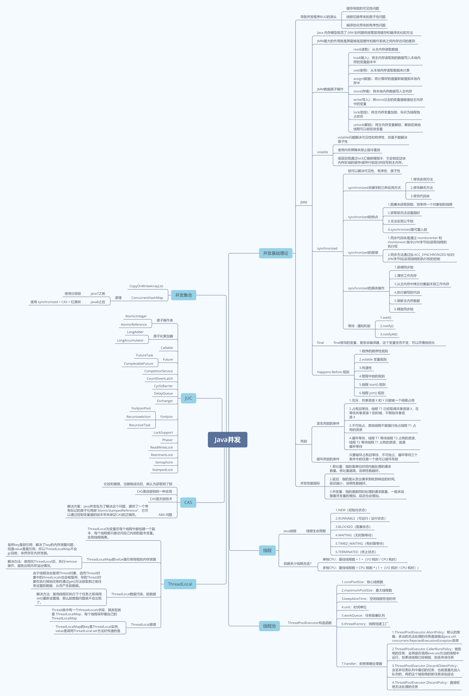

# 目录介绍
- lesson07: 第四周第七课
- lesson08: 第四周第八课
  - img: 图片

# 第四周作业
## 第七课:
- 第一题: [并发演练](https://github.com/WebbDong/java-concurrent)
- 第二题: [WaysToCreateThreads.java](https://github.com/WebbDong/JAVA-01/blob/main/Week_04/src/main/java/lesson07/WaysToCreateThreads.java)
## 第八课:
- 第一题: 列举常用的并发操作 API 和工具类，简单分析其使用场景和优缺点。  
>  1.synchronized 关键字    
>>   作用: synchronized 关键字提供互斥锁的功能，并且是可重入锁。配合 Object 的 wait()、notify()、notifyAll() 
>>       三个方法可以实现等待 - 通知机制。   
>>
>>   缺点:   
>>     1、获取锁无法设置超时  
>>     2、无法实现公平锁  
>>     3、synchronized 不能被中断  
>>     4、只能阻塞式的获取锁
>
>  2.volatile 关键字
>>   作用: 被 volatile 关键字修饰的变量，底层实现通过lock汇编前缀指令，它会锁定这块内存区域的缓存(缓存行锁定)并回写到主内存，
>>       并且强制从主内存中获取数据，从而解决可见性问题。并且禁止指令重排，从而解决有序性问题。
>>   
>>   缺点: 不能解决原子性问题
> 
> 3.原子类 AtomicInteger、AtomicReference 等
>>   作用: 提供简单的原子化操作，使用 CAS 无锁技术实现
>>
>>   缺点: 只能支持简单的操作，复杂的操作并不支持
> 
> 4.Callable 和 Future
>>   作用: 实现 Callable 接口的任务线程能返回执行结果，需要调用 FutureTask.get() 方法实现，此方法会阻塞调用者线程直到获取的结果。
>> 
>>   Runnable 和 Callable 的区别  
>>   1、实现 Callable 接口的任务线程能返回执行结果，而实现 Runnable 接口的任务线程不能返回执行结果  
>>   2、Callable 接口实现类中 call() 方法允许将异常向上抛出，也可以直接在内部处理(try...catch)，
>       而 Runnable 接口实现类中 run() 方法的异常必须在内部处理掉，不能向上抛出
> 
> 5.CompletableFuture
>>   作用: 提供异步编程的功能，并且提供任务的时序关系控制，例如串行关系、并行关系、汇聚关系等。   
>>
>>   应用场景: 用于一个大任务，其中可以分割出多个小任务且可以并行执行，多个小任务之间存在时序关系。例如烧水泡茶场景，任务1负责洗水壶、烧开水，
>>     任务2负责洗茶壶、洗茶杯和拿茶叶，任务3负责泡茶。其中任务1和任务2可以并行执行，任务3需要等待任务1和任务2执行完后才能开始。
> 
> 6.CompletionService
>>   作用: 提供批量执行异步任务的功能，内部维护了一个阻塞队列，当阻塞队列设置进数据时，就会处理。
>>
>>   应用场景: 例如有多个任务，这些任务没有时序关系，谁先处理执行完，谁就可以做下一步的处理，这时就可以使用 CompletionService。
>>     除此之外，CompletionService 能够让异步任务的执行结果有序化，先执行完的先进入阻塞队列，利用这个特性，你可以轻松实现后续处理的有序性，
>>     避免无谓的等待，同时还可以快速实现诸如 Forking Cluster 这样的需求。
> 
> 7.CountDownLatch
>>   作用: CountDownLatch可以实现多个线程间的协调等待，当计数器为0时，就会结束等待。
>>
>>   应用场景:    
>>   1、在 N 个线程执行完毕再继续执行某一线程    
>>   2、先阻塞 N 个线程，让在某个条件满足时，让这 N 个线程并行执行
>> 
>>   缺点:
>>   1、调用 countDown() 方法时当计数器为0后，就无法重置或者设置计数器。一个 CountDownLatch 的作用只能使用一次。
> 
> 8.CyclicBarrier
>>   作用: 是一组线程之间互相等待。当计数器为0时会调用回调函数。而且具备自动重置的功能，一旦计数器减到 0 会自动重置到你设置的初始值。
>
> 9.Fork/Join
>>   作用: Fork/Join 是一个并行计算的框架，主要就是用来支持分治任务模型的，这个计算框架里的 Fork 对应的是分治任务模型里的任务分解，
>>     Join 对应的是结果合并。Fork/Join 计算框架主要包含两部分，一部分是分治任务的线程池 ForkJoinPool，另一部分是分治任务 ForkJoinTask。
>>     ForkJoinPool 支持任务窃取机制，能够让所有线程的工作量基本均衡，不会出现有的线程很忙，而有的线程很闲的状况。
> 
> 10.ReentrantLock
>>   作用: ReentrantLock 默认是非公平锁，构造函数传入 true 为公平锁，并且也是可重入锁。
>>
>>   ReentrantLock 和 synchronized 的区别
>>   1、synchronized 是关键字，ReentrantLock 是 jdk 提供的 api 类
>>   2、synchronized 不能被中断而 ReentrantLock 可以中断
>>   3、synchronized 是非公平锁而 ReentrantLock 支持非公平锁也支持公平锁
>>   4、synchronized 只能阻塞式的获取锁，ReentrantLock 支持阻塞式的获取锁、获取锁超时机制和非阻塞地获取锁
> 
> 11.Semaphore
>>   作用: 信号量主要用于限流，底层基于 AQS 实现。
> 
> 12.ThreadLocal
>>   作用: ThreadLocal为变量在每个线程中都创建一个副本，每个线程都只能访问自己内部的副本变量。实现线程隔离。 
> 
> 13.ReadWriteLock
>>   作用: 读写锁有两个锁，读锁(共享锁)和写锁(排他锁、互斥锁)。允许多个线程同时读共享变量，但只允许一个线程写共享变量，
>>      当写共享变量时也会阻塞读的操作。这样在只有读的时候就不会互斥，提高读的效率。ReadWriteLock默认也是非公平锁
> 
> 14.StampedLock
>>   作用: ReadWriteLock 支持两种模式：一种是读锁，一种是写锁。而 StampedLock 支持三种模式，分别是：写锁、悲观读锁和乐观读。
>>      其中，写锁、悲观读锁的语义和 ReadWriteLock 的写锁、读锁的语义非常类似，允许多个线程同时获取悲观读锁，但是只允许一个线程获取写锁， 
>>      写锁和悲观读锁是互斥的。不同的是：StampedLock 里的写锁和悲观读锁加锁成功之后，都会返回一个 stamp；然后解锁的时候，需要传入这个 stamp。
>>      乐观读这个操作是无锁的，所以相比较 ReadWriteLock 的读锁，乐观读的性能更好一些。stamp 可以理解为关系型数据库乐观锁的 version
> 
- 第二题: 请思考：什么是并发？什么是高并发？实现高并发高可用系统需要考虑哪些因素，对于这些你是怎么理解的？
> 并发: 多个任务在同一个CPU 核上，按细分的时间片轮流(交替)执行，从逻辑上来看那些任务是同时执行。
> 
> 高并发: 是一种系统运行过程中遇到的一种“短时间内遇到大量操作请求”的情况。
> 
> 高并发的相关指标有响应时间、吞吐量、每秒查询率QPS、并发用户数

- 第三题: 请思考：还有哪些跟并发类似/有关的场景和问题，有哪些可以借鉴的解决办法。
> 1、其他并发问题
>> 1.1、SimpleDateFormat 是线程不安全的，内部有共享变量 calendar，在多线程环境下将会出现并发安全问题。
>>
>> 解决方案:   
>>    1、使用局部变量  
>>    2、使用互斥锁  
>>    3、使用 ThreadLocal，每个线程都使用自己的一个 SimpleDateFormat 实例  
>> 
>> 1.2、 32位的机器上对long型变量进行加减操作存在并发隐患  
>> 32位CPU上执行long型变量的写操作，long型变量是64位，在32位CPU上执行写操作会被拆分成两次写操作，线程切换带来的原子性问题。
>>
>> 解决方案:  
>>    在32位环境中，把 long\double 变量声明为 volatile 或是同步加锁 synchronize 以避免并发问题。
>> 
>> 1.3、数据库事务的并发问题  
>> 数据库的事务也存在并发问题，MySQL 通过锁机制和 MVCC 来解决并发问题。
> 
> 2、可以借鉴的解决方案    
>> 2.1、Immutability 模式    
>> Immutability 模式就是不变性模式，简单来讲，就是对象一旦被创建之后，状态就不再发生变化。换句话说，就是属性一旦被赋值后，就不会再修改，
>> 没有修改也就意味着不会有并发问题。使用此模式的有 String、Long、Integer、Double 等基本数据类型的包装类。
>>
>> 2.2、Copy-on-Write 模式   
>> COW 模式就是写时复制，写数据的时候复制出一个备份，在备份上进行写操作，写完后将备份替换原来的数据，读操作直接读取原来的数据，读操作无锁
>> 只在写操作时加锁。写操作时不影响读操作。所以，COW 模式适合读多写少的场景。使用此模式的有 CopyOnWriteArrayList、CopyOnWriteArraySet。
>>
>> 2.3、线程本地存储模式 (ThreadLocal)   
>> ThreadLocal 每个线程一个使用各自的实例，就可以避免并发问题。
> 
- 第四题: 并发脑图
  

# 第四周课程内容
## 第七课
> Java并发包、锁、并发原子类、并发工具类
## 第八课
> 常用线程安全类型、并发编程、并发编程面试题